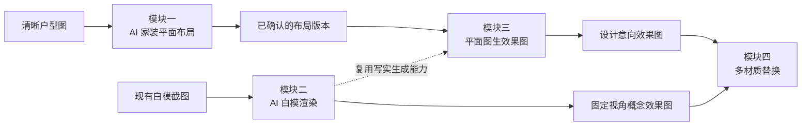
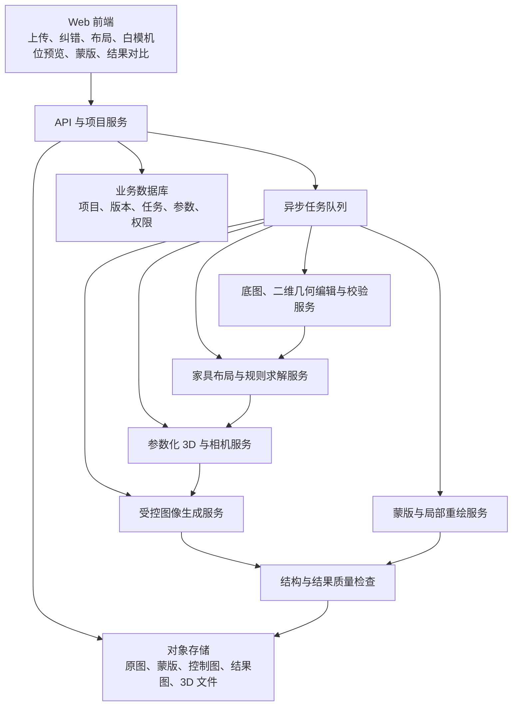
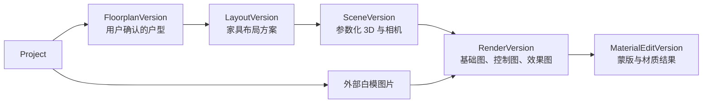

# AI 室内设计四模块最小 MVP 产品与技术方案

> 文档版本：V1.0  
> 编写日期：2026 年 7 月 29 日  
> 文档状态：MVP 产品与技术评审稿  
> 产品定位：面向设计师和家装顾问的概念方案与客户沟通工具

---

## 1. 文档目标

本文将以下四份分析文档收敛为一套可以立项、研发和验收的最小 MVP：

| 原始分析文档 | 本文对应模块 |
|---|---|
| [AI家装平面布局实现原理与技术方案.md](./AI家装平面布局实现原理与技术方案.md) | 模块一：AI 家装平面布局 |
| [AI室内设计白模渲染技术实现分析.md](./AI室内设计白模渲染技术实现分析.md) | 模块二：AI 白模渲染 |
| [平面图生效果图技术方案.md](./平面图生效果图技术方案.md) | 模块三：平面图生效果图 |
| [多材质替换技术实现分析.md](./多材质替换技术实现分析.md) | 模块四：多材质替换 |

本文所说的“最小 MVP”不是完整产品的缩小描述，而是首版真正需要交付的最小闭环：

- 用户可以独立完成一次任务；
- 结果具备明确、可感知的使用价值；
- 输入范围、输出承诺和失败条件清晰；
- 不依赖首版自研大模型或大规模训练；
- 每个模块都有可量化的发布门槛；
- 模块一、二、四可以独立使用；模块三只消费模块一的确认结果或规定格式的结构化 JSON。四个模块可以组成一条完整业务链路。

---

## 2. MVP 总体结论

### 2.1 四个模块的一句话定义

| 模块 | MVP 一句话定义 | 首版输出 |
|---|---|---|
| AI 家装平面布局 | 在用户确认过的固定户型内，生成最多两套无硬碰撞、方向明确的家具布局 | 1～2 套二维布局、指标及结构化数据 |
| AI 白模渲染 | 将一张单空间白模截图转换为两张固定视角的预设风格概念图 | 2 张 1024 级候选图 |
| 平面图生效果图 | 将已确认的单房间结构化布局转换为一个指定机位的设计意向效果图 | 白模预览及 1 张 1024 级效果图 |
| 多材质替换 | 在一张已有室内图中，对墙面和地面替换固定材质风格预设 | 1 张双材质替换对比图 |

### 2.2 两条完整用户闭环



闭环 A：用户上传户型图，确认结构，获得一至两套家具布局；选择其中一套和一个房间，生成效果图，再对墙面和地面进行材质对比。

闭环 B：已有 SketchUp、3ds Max、Blender 等软件白模的用户，直接上传白模截图生成概念图，再进入多材质替换。

### 2.3 首版统一边界

| 维度 | MVP 支持 | MVP 不支持 |
|---|---|---|
| 产品用途 | 概念布局、风格探索、客户沟通、快速选材 | 施工图、工程审核、材料算量、正式报价 |
| 空间 | 单层普通住宅、规则直墙、常见房间 | 复式、跃层、曲墙、异形楼梯、复杂商业空间 |
| 图纸 | 清晰 PNG/JPG/PDF 作为描图底图，或规定格式的结构化 JSON | 低清拍照、手绘草图、复杂 CAD 全量解析 |
| 布局 | 固定墙体下的客厅、餐厅、卧室家具布置 | 自动拆墙、新建墙、厨卫移位、承重判断 |
| 效果图 | 单房间、单机位、固定风格、单张或两张结果 | 任意机位、多视角一致、全屋漫游、360° 全景 |
| 材质 | 固定材质风格预设、二维视觉预览 | PBR、真实色差、施工级铺贴、真实 SKU |
| 模型 | 使用已有可商用模型、API 或授权权重 | 首版训练基础模型、LoRA 或多视图生成模型 |
| 输出精度 | 视觉上基本保持结构 | 毫米级还原、物理光照准确、施工可落地承诺 |

所有页面和导出结果应明确标注：

> AI 结果用于概念设计与效果预览，不作为尺寸、材料色差或施工依据。

---

## 3. 共用产品与技术底座

### 3.1 核心原则

1. **已确认的结构化场景是空间真值。**  
   墙体、门窗、房间和家具占地只维护一份数据，模块之间通过版本号引用，不重复识别和复制。

2. **用户确认的数据才可进入布局与 3D。**  
   首版以结构化数据导入或“图片底图 + 人工描绘”为 P0；自动识别只作为实验能力，不计入发布依赖。

3. **图像生成不负责决定建筑结构。**  
   平面图生效果图先生成参数化 3D 和真实相机，AI 只负责写实增强。

4. **所有耗时任务异步执行。**  
   底图处理、布局求解、3D 构建、图像生成和材质替换都返回任务 ID，可查询、重试和取消。

5. **所有结果完整可追溯，并在供应商支持时尽力复现。**  
   保存输入版本、供应商、模型修订版、工作流版本、随机种子、风格预设、生成参数和原始响应元数据。第三方模型静默升级时不承诺像素级复现。

6. **首版不自研大模型。**  
   通过模型适配层接入现有可商用能力，先验证业务价值、质量上限和单位成本。

### 3.2 共用架构



### 3.3 建议的最小技术栈

| 层级 | 建议方案 |
|---|---|
| Web 前端 | React/Vue + Canvas/SVG |
| API | FastAPI、NestJS 或现有后端框架 |
| 二维几何 | Shapely/GEOS 或成熟二维几何库 |
| 布局求解 | 规则模板 + 回溯搜索或 OR-Tools CP-SAT |
| 3D 场景 | Blender 无界面建模、低清机位预览和基础渲染 |
| 图像处理 | OpenCV + Canny/Lineart 等现成预处理器 |
| 生成能力 | 支持结构条件和局部重绘的商用 API 或授权模型 |
| 蒙版编辑 | Canvas/SVG 画笔、多边形、擦除和撤销 |
| 任务系统 | Redis Queue、Celery、Temporal 或现有任务平台 |
| 数据 | PostgreSQL + S3 兼容对象存储 |
| 监控 | 任务成功率、P50/P95 延迟、单次成本和质量拒绝率 |

生成模型必须通过统一适配层接入。模型供应商、权重或推理工作流发生变化时，不应影响项目、场景和版本数据。

### 3.4 坐标、竖向参数与资产契约

全链路持久化数据统一使用毫米，不允许模块一保存毫米、模块三再把同一字段解释为米：

- 二维平面使用 XY 坐标，原点为户型包围盒左下角；
- `+X` 向右，`+Y` 向上；
- 外轮廓顶点逆时针，孔洞顺时针；
- `rotationDeg` 从 `+X` 方向逆时针计算；
- 进入 3D 引擎时由适配层执行 `mm / 1000`，映射为 `X = 平面 X`、`Z = 平面 Y`、`Y = 高度`；
- 所有几何数据携带 `schemaVersion`，坐标规则升级时不得静默改变旧版本含义。

平面图无法提供的竖向信息使用可见、可修改的默认值，并在进入 3D 前要求用户确认：

| 参数 | MVP 默认值 |
|---|---:|
| 层高 | 2800 mm |
| 室内门高 | 2100 mm |
| 窗台高 | 900 mm |
| 窗高 | 1500 mm |

这些值必须写入 `SceneVersion`，并记录 `source = system_default/user` 与 `confirmedByUser`，不能隐式写死在渲染代码中。

3D 家具资产至少包含：

```json
{
  "assetId": "asset_sofa_001",
  "category": "sofa",
  "dimensionsMm": [2200, 900, 820],
  "pivot": "footprint_center",
  "forwardAxis": "+Z",
  "allowedScaleRange": [0.95, 1.05],
  "wallContactSide": "back",
  "footprintMm": [[-1100, -450], [1100, -450], [1100, 450], [-1100, 450]]
}
```

---

## 4. 模块一：AI 家装平面布局 MVP

### 4.1 产品目标

在不改变墙体、门窗、厨房和卫生间的前提下，根据固定表单需求，为常见住宅生成最多两套家具级布局：

- 方案 A：动线优先；
- 方案 B：空间利用优先。

核心价值是减少手工试摆和基础碰撞检查时间，不是自动完成建筑改造设计。

### 4.2 支持范围

| 项目 | MVP 约束 |
|---|---|
| 住宅范围 | 单层、建筑面积不超过 120㎡、房间不超过 8 个 |
| 几何范围 | 以水平和垂直直墙为主 |
| 自动布置房间 | 客厅、餐厅、卧室 |
| 固定不动对象 | 全部墙体、门窗、厨卫、阳台、固定设备 |
| 家具来源 | 系统内置标准尺寸家具 |
| 需求输入 | 固定表单，不依赖自由对话 |
| 结果数量 | 1～2 套非劣方案；只有一个可行解时不强造差异 |

用户需要输入或确认：

- 户型比例或一段已知长度；
- 墙体、门窗和房间边界；
- 房间用途；
- 床型、衣柜、书桌、沙发座位数和餐桌人数；
- 必须保留的家具；
- 优先策略。

### 4.3 用户流程

```text
上传清晰户型图作为描图底图，或读取规定格式的结构化数据
→ 用户描绘或校正墙线、门窗和房间
→ 确认比例与结构
→ 填写家具需求
→ 检索房间布局模板
→ 枚举家具位置和方向
→ 硬约束求解与碰撞检查
→ 分别按两种策略评分
→ 去重并返回最多两套非劣方案
→ 用户对比、简单微调、再次校验和导出
```

### 4.4 P0 功能

- 清晰 PNG/JPG/PDF 上传；
- 图片作为锁定比例的描图底图；
- 规定格式的户型 JSON 导入；
- 画墙、删墙、拖动角点、增删门窗、修改房间类型；
- 已知长度标定；
- 房间闭合和门窗吸附检查；
- 客厅、餐厅、卧室的结构化需求表单；
- 小型标准家具库；
- 家具靠墙锚点和候选朝向生成；
- 家具与墙体、家具之间、门扇开启区的碰撞检测；
- 版本化净空规则表，明确各家具使用侧、门扇区和主通道的阈值；
- 两种固定评分策略；
- 无解原因提示；
- 最多两套方案的 SVG/PNG 预览和 JSON 输出；
- 家具拖动、90° 旋转、吸附、再次校验并保存新的 `LayoutVersion`。

布局算法首版采用“模板 + 确定性求解”，不使用端到端生成模型：

```text
房间类型模板
+ 家具标准尺寸
+ 靠墙与朝向候选
+ 门窗和通道禁入区
        ↓
可行性求解
        ↓
动线分数／空间利用分数
        ↓
最多两套非劣方案
```

### 4.5 输入与输出

输入核心字段：

```json
{
  "floorplanId": "floorplan_001",
  "floorplanVersion": 3,
  "confirmedByUser": true,
  "unit": "mm",
  "rooms": [],
  "walls": [],
  "openings": [],
  "fixedObjects": [],
  "requirements": {
    "sofaSeats": 3,
    "diningSeats": 4,
    "bedrooms": [
      {"roomId": "room_02", "bedType": "bed_1800", "needWardrobe": true}
    ]
  }
}
```

每套输出至少包含：

```json
{
  "layoutId": "layout_001",
  "layoutVersion": 1,
  "sourceFloorplanId": "floorplan_001",
  "sourceFloorplanVersion": 3,
  "strategy": "circulation_first",
  "placements": [],
  "hardViolations": [],
  "metrics": {
    "requirementCoverage": 0.92,
    "minimumClearanceMm": 820,
    "usableAreaRatio": 0.76
  },
  "warnings": []
}
```

### 4.6 验收标准

在 30～50 套符合范围的固定测试户型上：

| 指标 | 发布门槛 |
|---|---:|
| 用户确认后的房间闭合成功率 | 100% |
| 比例误差 | ≤ 2% |
| 可生成至少一套可行方案的户型比例 | ≥ 90% |
| 经人工确认存在多个解的测试任务中，返回两套非劣解 | ≥ 80% |
| 120㎡、8 房间以内生成耗时 P95 | ≤ 30 秒 |
| 家具与墙体硬重叠 | 0 |
| 家具之间硬碰撞 | 0 |
| 家具阻挡入户门或房门开启 | 0 |
| 家具超出所属房间 | 0 |
| 设计师认为“可继续修改”的方案比例 | ≥ 70% |
| 新用户从上传或导入到首套方案的中位时间 | ≤ 15 分钟 |

返回两套方案时，关键家具位置、方向或动线策略必须有明显差异。只有一个可行解时允许只返回一套。无法满足全部需求时必须返回冲突原因，不得输出伪可行方案。

### 4.7 明确不做

- 不判断承重墙；
- 不拆墙、新建墙或移动门窗；
- 不改变厨房、卫生间、烟道、燃气和上下水；
- 不处理曲墙、复式、跃层和多层住宅；
- 不执行地域法规和施工规范审核；
- 不输出 DWG、IFC、拆改图、水电图或预算；
- 不支持任意品牌和任意尺寸家具；
- 不提供连续自然语言对话式改图。

自动墙线、门窗和房间识别可以进入技术验证，但不属于 P0，也不计入上线依赖。求解无解时返回冲突家具和建议放宽项。

---

## 5. 模块二：AI 白模渲染 MVP

### 5.1 产品目标

让用户上传一张干净的单空间白模截图，选择一个固定风格，在约一分钟内获得两张保持原视角和主要空间轮廓的概念效果图。

本模块是“固定视角的二维概念渲染”，不是三维建模或物理渲染。

### 5.2 支持范围

| 项目 | MVP 约束 |
|---|---|
| 输入 | 单张 JPG/PNG 白模截图 |
| 场景 | 单一室内空间，优先客厅、餐厅、卧室 |
| 视角 | 固定为输入图视角 |
| 风格 | 3～5 个经回归测试的固定预设 |
| 用户描述 | 可选，不超过 100 字 |
| 输出 | 2 张同宽高比、长边至少 1024 px 的候选图 |

白模建议无文字、尺寸线、水印和复杂遮挡。用户只需选择：

- 房间类型；
- 风格预设；
- 可选的色彩、材质和灯光补充描述。

### 5.3 用户流程与实现

```text
上传白模
→ 文件和输入质量检查
→ 等比缩放、补边和亮度归一化
→ 提取一种结构控制图
→ 组合房间类型、风格模板和用户描述
→ 结构受控的 Image-to-Image
→ 使用两个随机种子生成候选
→ 基础异常检查
→ 返回预览、下载和重新生成
```

真正最小的实现只上线一种结构控制方式：

- 首选 Canny，部署简单，适合边界清晰的白模；
- 如果固定测试集证明白色区域轮廓不足，则整体改用 Lineart；
- 首版不同时组合深度、法线和语义分割。

### 5.4 P0 功能

- 白模上传、格式和尺寸校验；
- 对比度增强、缩放和补边；
- Canny 或 Lineart 结构提取；
- 3～5 个固定室内风格提示词模板；
- 一个支持结构控制的图像生成模型或 API；
- 每次生成两个随机种子；
- 异步任务、状态查询和失败重试；
- 保存输入、结构图、风格、模型、工作流、参数和随机种子；
- 黑图、空图、服务错误和内容安全检查；
- 预览、下载和重新生成。

### 5.5 接口

```http
POST /v1/white-model-renders
GET  /v1/jobs/{jobId}
```

创建任务示例：

```json
{
  "sourceImageId": "img_white_001",
  "roomType": "living_room",
  "stylePresetId": "modern_minimal_v1",
  "prompt": "浅木色、暖光、米白色布艺",
  "output": {
    "longEdge": 1024,
    "count": 2
  }
}
```

### 5.6 验收标准

以不少于 30 张符合输入规范的客厅、餐厅和卧室白模作为固定测试集：

| 指标 | 发布门槛 |
|---|---:|
| 异步任务技术成功率 | ≥ 95% |
| 无排队时生成 2 张图的 P90 | ≤ 60 秒 |
| 输出长边 | ≥ 1024 px |
| 相机和主要空间边界人工通过率 | ≥ 80% |
| 门窗及主要柜体位置保持人工通过率 | ≥ 80% |
| 预设风格可辨识人工通过率 | ≥ 80% |
| 严重畸变或与输入无关的结果比例 | ≤ 10% |
| 不合规输入返回明确原因 | ≤ 3 秒 |

### 5.7 明确不做

- 不从白模恢复可编辑 3D；
- 不支持现场照片、CAD、手绘线稿等其他输入；
- 不支持参考图上传和任意风格迁移；
- 不支持多房间或多视角一致；
- 不支持局部区域修改；
- 不做真实家具、材料和商品匹配；
- 不做 PBR、真实光照、材料规格或施工节点；
- 不训练自有模型或 LoRA；
- 不做超分、美学排序和复杂自动修复。

失败降级：输入边缘不足时提示重新导出白模；生成漂移时允许更换随机种子重新生成，不向用户承诺每次必然可用。

---

## 6. 模块三：平面图生效果图 MVP

### 6.1 产品目标

从模块一输出的已确认布局中，选择一个房间、一个推荐机位和一个固定风格，生成一张布局基本一致的设计意向效果图。

本模块不重复开发平面图识别器。它只消费已确认的 `layoutId + layoutVersion`，由此创建参数化 `sceneVersion`。没有模块一结果时，只允许导入规定 schema 的结构化 JSON；本模块不额外建设一套 BIM-lite 编辑器。

### 6.2 支持范围

| 项目 | MVP 约束 |
|---|---|
| 输入 | 已确认的单层 `LayoutVersion`，或规定 schema 的结构化 JSON |
| 空间 | 一个规则直墙房间 |
| 房间类型 | 客厅、餐厅、卧室 |
| 几何 | 墙、地、顶、门窗和家具占地 |
| 资产 | 小型授权通用家具资产库 |
| 相机 | 系统生成 2～3 个安全机位，用户选择一个 |
| 风格 | 3 个固定风格 |
| 灯光 | 固定白天柔光 |
| 输出 | 1 张白模预览 + 1 张约 1024×768 的效果图 |

### 6.3 用户流程与实现

```text
读取已确认的 layoutVersion
→ 校验房间、墙体和门窗拓扑
→ 用户确认层高、门高、窗台高和窗高
→ 墙体拉伸、门窗开洞、生成地面和顶面
→ 将家具占地映射到通用占位资产
→ 生成 2～3 个不穿墙的安全机位
→ Blender 返回 2～3 张低清白模机位预览
→ 用户选择一个机位
→ 输出基础 RGB 和一张 Edge 或 Depth 控制图
→ 复用白模渲染服务执行写实增强
→ 检查门窗和墙体轮廓
→ 不合格时重试一次或回退基础渲染
→ 输出单张效果图
```

这里的“指定角度”必须对应真实三维相机，而不是一段提示词。

MVP 的写实增强仍只使用一张结构控制图：从 3D 输出的 Edge 或 Depth 中，根据阶段 0 的固定测试结果选择更稳定的一种。其他通道用于质量检查、对象追溯或后续升级，首版不做多条件联合生成。

### 6.4 P0 功能

- 读取不可变的结构化布局版本；
- 房间拓扑校验；
- 层高、门高、窗台高和窗高确认；
- 参数化墙体、地面、顶面和门窗开洞；
- 家具占地框到有限通用 3D 占位资产的映射；
- 规则生成 2～3 个安全机位；
- 相机穿墙、落入家具和目标房间覆盖检查；
- Blender 无界面生成低清白模预览和基础渲染；
- 基础 RGB 加一张 Edge 或 Depth 控制图；
- 3 个固定风格和固定白天灯光；
- 复用模块二的图像生成、任务、存储和版本能力；
- 门窗数量、位置和主要墙线的基础结构检查；
- AI 失败时回退基础渲染。

### 6.5 最小场景数据

```json
{
  "sceneId": "scene_123",
  "sceneVersion": 3,
  "sourceLayoutId": "layout_001",
  "sourceLayoutVersion": 1,
  "unit": "mm",
  "ceilingHeightMm": 2800,
  "verticalParametersConfirmed": true,
  "rooms": [],
  "walls": [],
  "openings": [],
  "furniture": [
    {
      "id": "f_01",
      "category": "sofa",
      "roomId": "living_01",
      "footprintMm": [[1000, 1000], [3200, 1000], [3200, 2000], [1000, 2000]],
      "rotationDeg": 90
    }
  ]
}
```

创建任务：

```http
GET  /v1/scenes/{sceneId}/camera-presets?roomId={roomId}
POST /v1/effect-renders
GET  /v1/jobs/{jobId}
```

```json
{
  "sceneId": "scene_123",
  "sceneVersion": 3,
  "roomId": "living_01",
  "cameraPresetId": "corner_02",
  "stylePresetId": "modern_warm_v1",
  "lightingPresetId": "daylight_soft_v1",
  "output": {
    "width": 1024,
    "height": 768,
    "count": 1
  }
}
```

结果必须记录解析后的相机位置、目标点和视场角，不能只保存机位名称。

### 6.6 验收标准

在不少于 30 个符合范围的已确认单房间测试场景上：

| 指标 | 发布门槛 |
|---|---:|
| 合法场景生成基础几何成功率 | 100% |
| 墙、门、窗数量与输入一致 | 100% |
| 推荐机位不穿墙、不落入家具 | 100% |
| 目标房间进入相机视锥 | 100% |
| 白模预览 P95 | ≤ 10 秒 |
| 自动重试至多一次后的端到端成功率 | ≥ 95% |
| 1024 级效果图 P95 | ≤ 120 秒 |
| 主要门窗无新增或删除 | ≥ 95% |
| 沙发、床、餐桌等关键家具的类别、数量和粗略区域保持 | ≥ 85% |
| “空间关系与布局基本一致”人工通过率 | ≥ 90% |
| “可用于早期客户沟通”设计师通过率 | ≥ 80% |

每张结果必须可以追溯到场景版本、相机、风格、基础渲染、控制图、模型和工作流版本。

### 6.7 明确不做

- 不在本模块内解析原始 PNG、PDF 或 CAD；
- 不使用未经用户确认的识别结果；
- 不提供独立的 BIM-lite 人工编辑器；
- 不支持全屋、多层、复式、曲墙和异形楼梯；
- 不支持自由相机、漫游、全景或多视角一致；
- 不自动恢复吊顶、灯带、复杂立面和窗外景观；
- 不接受自由文本风格和参考图；
- 不自动生成新的家具布局；
- 不支持真实商品 SKU、BOM、报价和施工输出；
- 不提供夜景、多套灯光和物理光照承诺。

失败降级：结构化场景不合法时退回上游修正；AI 写实图破坏结构时自动重试一次，仍失败则返回基础渲染并说明原因。

---

## 7. 模块四：多材质替换 MVP

### 7.1 产品目标

让用户在一张已有室内效果图或白模渲染结果中，手工选定墙面和地面并替换两种固定材质风格，例如“暖灰墙漆 + 浅色木地板”，快速比较搭配方向。

首版定位为二维“快速视觉预览”，不承诺真实色差、物理反射和施工级铺贴。

### 7.2 支持范围

| 项目 | MVP 约束 |
|---|---|
| 输入 | 1 张 JPG/PNG 室内图，原图最长边不超过 2048 px |
| 区域 | 1～2 个互不重叠的手工蒙版 |
| 区域类型 | 墙面、地面 |
| 材质 | 8 个有授权的固定材质风格预设：墙面 4 个、地面 4 个 |
| 参数 | 替换强度：低、中、高 |
| 输出 | 与 1024 级标准工作图同尺寸的无损 PNG、原图对比 |

首版使用人工多边形或画笔选区，不将自动分割设为上线依赖。

系统先把原图等比缩放为长边 1024 px 的标准工作图，蒙版绘制、局部重绘、合成和像素比较全部在该坐标空间完成，并保存从原图到工作图的缩放比例。这样“非目标区域像素不变”有明确且可重复的比较基准。

### 7.3 用户流程与实现

```text
上传图片或选择已有渲染结果
→ 用多边形或画笔绘制两个区域
→ 选择墙面或地面语义
→ 为每个区域选择兼容的固定材质风格预设
→ 校验蒙版不重叠
→ 每个区域都以原图为输入独立局部重绘
→ 只提取各自蒙版内结果
→ 分层合成、边缘羽化和局部亮度匹配
→ 输出原图／结果对比
```

每个区域必须从原图独立计算，不能在上一个区域的结果上连续重绘。最终强制使用原图覆盖蒙版外像素，减少累计漂移。

### 7.4 P0 功能

- 从本地上传图片或选择模块二、模块三的结果；
- Canvas/SVG 多边形和画笔选区；
- 擦除、撤销、重做和蒙版显示；
- 蒙版孔洞填充、轻度平滑和重叠检测；
- 墙面、地面两种人工语义；
- 8 个固定授权材质风格预设；
- 每个预设绑定内部参考纹理、适用表面类型、提示词、负向提示词和强度；
- 原图 + 蒙版的局部重绘；
- 双区域独立生成、分层合成和 3～8 px 羽化；
- 一个区域失败时单独重试；
- 原图／结果图对比和下载；
- 保存区域、材质、模型和工作流版本。

### 7.5 接口

```http
POST /v1/material-replacement-renders
GET  /v1/jobs/{jobId}
```

请求示例：

```json
{
  "sourceImageId": "img_123",
  "parentRenderId": "render_456",
  "regions": [
    {
      "regionId": "region_1",
      "semanticClass": "wall",
      "maskImageId": "mask_1",
      "materialStylePresetId": "paint_warm_gray_v1",
      "strength": "medium"
    },
    {
      "regionId": "region_2",
      "semanticClass": "floor",
      "maskImageId": "mask_2",
      "materialStylePresetId": "oak_light_v1",
      "strength": "medium"
    }
  ],
  "output": {
    "longEdge": 1024,
    "count": 1
  }
}
```

### 7.6 验收标准

使用不少于 30 张符合范围的固定室内测试图，每张图包含两个测试区域：

| 指标 | 发布门槛 |
|---|---:|
| 双区域任务端到端成功率 | ≥ 95% |
| 自动重试至多一次后的完成时间 P95 | ≤ 120 秒 |
| 羽化带之外的非目标区域像素 | 保持不变 |
| 材质不明显串入另一区域的人工通过率 | ≥ 90% |
| 墙面和地面主要轮廓保持人工通过率 | ≥ 85% |
| 两个区域材质可明确区分的人工通过率 | ≥ 90% |
| 结果与用户所选材质风格预设语义匹配 | ≥ 85% |
| 单区域重试 | 不影响另一区域及原图 |

### 7.7 明确不做

- 不自动识别全部可编辑区域；
- 不做点击自动分割和智能吸边；
- 不支持超过两个区域；
- 不允许用户上传任意材质图；
- 不处理镜面、玻璃、金属、高反射面、复杂织物和曲面；
- 不支持 PBR、物理尺寸、产品 SKU 和真实色差；
- 不精确控制瓷砖缝、木纹重复次数和铺贴算量；
- 不做批量材质组合、多视角一致和 3D 回写；
- 不承诺新材质对整个空间反射和光照的物理影响。

失败降级：蒙版重叠或过小时在提交前提示；单区域生成失败时只重试该区域；复杂边缘由用户手工修正。

---

## 8. 四模块数据衔接

### 8.1 版本链



关键规则：

- 上游版本一旦被下游引用，不直接覆盖，只创建新版本；
- 每个效果图必须绑定确定的场景、相机、风格和模型版本；
- 多材质结果保存 `parentRenderId`，但首版不回写 3D；
- 外部白模可以跳过平面和场景版本，直接创建渲染版本；
- 后续可以让模块三额外生成 Object ID 蒙版以加速选区，但它不是模块四 MVP 的依赖。

### 8.2 最小共用接口

| 接口 | 用途 |
|---|---|
| `POST /v1/projects` | 创建项目 |
| `POST /v1/floorplans` | 上传户型图 |
| `PATCH /v1/floorplans/{floorplanId}/elements` | 校正墙体、门窗和房间 |
| `POST /v1/floorplans/{floorplanId}/confirm` | 创建已确认户型版本 |
| `POST /v1/layouts` | 生成一至两套家具布局 |
| `POST /v1/layouts/{layoutId}/build-3d` | 从指定布局版本生成单房间 3D |
| `GET /v1/scenes/{sceneId}/camera-presets` | 获取安全机位 |
| `POST /v1/effect-renders` | 从场景生成效果图 |
| `POST /v1/white-model-renders` | 从白模截图生成效果图 |
| `POST /v1/material-replacement-renders` | 生成多材质替换结果 |
| `GET /v1/jobs/{jobId}` | 查询统一任务状态 |
| `POST /v1/jobs/{jobId}/retry` | 重试可恢复任务 |
| `POST /v1/jobs/{jobId}/cancel` | 取消尚未完成的任务 |

统一任务状态：

```text
QUEUED
→ RUNNING
→ SUCCEEDED / FAILED / CANCELED
```

“户型是否已确认”属于资源状态，而不是长时间运行的任务状态：

```text
FloorplanVersion: DRAFT → CONFIRMED
```

重试必须创建新任务并保存 `parentJobId`。所有可能产生 GPU/API 费用的创建接口都必须接受 `Idempotency-Key`，避免网络重试造成重复生成和重复计费。

失败状态至少区分：

- `INPUT_REJECTED`
- `SCENE_INVALID`
- `SOLVER_NO_SOLUTION`
- `RENDER_FAILED`
- `GENERATION_FAILED`
- `QUALITY_REJECTED`

错误响应必须包含用户可理解的原因和下一步建议。

---

## 9. MVP 验证与发布标准

### 9.1 固定测试集

正式开发前建立两套互不重叠的数据：

- 开发调参集：用于模型、参数、规则和阈值选择；
- 冻结盲测集：在发布评审前不用于调参，表中数量均指盲测集。

| 测试集 | 最小数量 | 用途 |
|---|---:|---|
| 清晰规则住宅户型 | 30～50 套 | 描绘/导入、几何校验和布局求解 |
| 单房间结构化场景 | 30 个 | 3D 构建、机位和效果图 |
| 单空间白模截图 | 30 张 | 白模结构保持和风格稳定性 |
| 双区域材质图片 | 30 张 | 蒙版、局部重绘和材质串区 |
| 端到端项目 | 20 个 | 四模块衔接和版本追溯 |

测试集要覆盖客厅、餐厅、卧室。每个任务执行前由版本化输入校验器判定是否属于支持范围，不能在结果失败后再从统计分母中剔除。发布报告分别统计：

- 输入受理率和拒绝原因；
- 技术任务成功率；
- 质量通过率；
- 自动重试率；
- 降级率；
- 用户端到端完成率。

不支持输入单独进入拒绝与提示测试集。

所有人工质量指标采用同一评审协议：至少 3 名室内设计师盲评，使用固定评分表；2/3 及以上判定通过才计为通过。评分表需列出严重错误，例如增删门窗、弯曲主墙、关键家具消失、材质串区和明显透视错误，并定义允许的位置或轮廓偏差。

所有延迟指标必须同时记录测试硬件或第三方 API 套餐、冷/热启动、并发量和队列情况，并分别报告“纯处理耗时”和“用户端到端耗时”。

### 9.2 全局发布门槛

- 四个模块的 P0 功能全部完成；
- 各模块达到本文件中的发布指标；
- 20 个端到端项目全部能够追溯到原始输入和各级版本；
- 至少 90% 的端到端项目无需工程人员介入即可走完全链路，且最终结果通过对应质量门槛；
- 合法任务在自动重试一次后，技术成功率不低于 95%；
- 模块三分别统计 `effect_render_succeeded` 和 `degraded_to_base_render`；回退基础渲染只算任务已完成，不计入 AI 效果图质量成功率；
- 不支持的输入均能返回清晰说明，不出现无期限等待；
- 用户可删除项目及其原图、控制图、蒙版和结果图，并触发第三方留存数据的删除流程；
- 模型、资产和材质均有明确商用许可记录；
- 第三方模型供应商明确承诺不使用客户图片训练，披露保存期限、处理地域和删除机制，并在上传前完成用户告知；
- 所有概念结果均有“非施工依据”提示；
- 建立单任务成本、P50/P95 延迟、失败率和用户选用率监控。
- 阶段 0 由业务负责人冻结模块二、三、四的单任务成本上限及完整链路成本上限；未确定或实测超限不得发布。

### 9.3 业务验证指标

技术指标达标不等于产品有效。灰度期还应观察：

- 从上传到获得首个可用结果的完成率；
- 一至两套布局的查看、选择和手工修改比例；
- 白模候选图的下载或再次生成比例；
- 平面图效果图的保存和客户分享比例；
- 材质替换的完成率和单区域重试次数；
- 设计师认为“比原流程节省时间”的比例；
- 单项目 GPU/API 成本及毛利空间。

---

## 10. 建议实施计划

以下计划假设复用现有项目、存储、任务和二维编辑底座，接入可商用模型/API，不从零训练基础模型，并允许模块并行开发。

| 阶段 | 建议时间窗 | 主要交付 |
|---|---:|---|
| 阶段 0：技术验证 | 第 1～2 周 | 固定测试集、模型/API 选型、成本和质量基线、统一数据模型 |
| 阶段 1：基础底座 | 第 1～3 周 | 项目、存储、任务、版本、权限、统一前端框架 |
| 阶段 2：布局与白模 | 第 3～6 周 | 模块一和模块二可独立完成闭环 |
| 阶段 3：3D 与效果图 | 第 4～8 周 | 参数化单房间、机位、基础渲染、模块三 |
| 阶段 4：材质与集成 | 第 7～10 周 | 模块四、跨模块跳转、端到端版本链 |
| 阶段 5：灰度发布 | 第 11～12 周 | 回归、性能、成本、许可、安全和小流量验证 |

具备上述成熟底座且人员并行时，建议总周期为 10～12 周。若项目、版本系统、二维编辑器和任务平台都需要从零建设，应按 16～20 周评估，或按模块独立发布，不承诺同一时间完成四个模块。

建议最小团队能力构成：

- 1 名产品/室内设计负责人；
- 1～2 名前端工程师；
- 1 名后端与任务系统工程师；
- 1 名二维几何/布局工程师；
- 1 名 3D/图形工程师；
- 1 名生成式 AI/CV 工程师；
- 1 名测试，可由团队部分兼任。

### 10.1 推荐的开发顺序

1. 先冻结统一 `floorplanVersion`、`layoutVersion`、`sceneVersion`、`renderVersion` 和任务协议；
2. 并行验证家具布局求解与白模生成效果；
3. 用模块一的结构数据构建单房间 3D；
4. 复用模块二的生成能力完成平面图效果图；
5. 最后接入图片级多材质替换；
6. 完成端到端回归后再扩大输入范围和风格数量。

---

## 11. 主要风险与应对

| 风险 | 影响 | MVP 应对 |
|---|---|---|
| 人工描绘或导入的户型数据错误 | 布局和 3D 全链路错误 | 闭合、吸附、比例和门窗连接校验；强制用户确认 |
| 布局需求无解 | 用户认为系统失效 | 返回冲突家具、净距和可放宽项，不伪造结果 |
| 白模或效果图结构漂移 | 门窗、墙线和家具变化 | 固定低自由度参数；结构检查；重试一次；回退基础图 |
| 小型资产库导致效果重复 | 视觉多样性不足 | 接受首版重复，优先验证空间与出图闭环 |
| 材质替换泄漏或改动原图 | 对比失真 | 每区从原图生成；蒙版内合成；蒙版外强制恢复原图 |
| 用户把概念图当施工成果 | 专业责任风险 | 页面和导出图持续标注“非施工依据” |
| 第三方模型成本或限流变化 | 延迟和毛利不稳定 | 模型适配层、配额、缓存、单次成本监控和备选供应商 |
| 模型、素材或资产许可不清 | 无法商业发布 | 发布前建立逐项许可清单，不使用来源不明数据 |
| 客户户型和效果图泄露 | 隐私与商业风险 | 私有对象存储、租户隔离、短期签名链接、可删除和审计 |
| 四个模块各自维护数据 | 版本错配和重复开发 | 统一项目、场景、图片、任务和父子版本关系 |

---

## 12. MVP 之后的升级顺序

以下能力有价值，但不应进入本次 MVP：

1. 户型墙线、门窗和房间的自动识别与低置信纠错；
2. 点选自动分割、智能吸边和 Object ID 直接选材；
3. 用户上传材质参考图、无缝纹理和纹理尺度控制；
4. 更多房间类型、风格和家具资产；
5. 局部锁定后重新求解家具布局；
6. 有限隔墙调整和案例检索；
7. 真实商品 SKU、PBR、材质规格和报价；
8. 多机位一致、全屋场景和漫游；
9. CAD/BIM 回写、BOM、施工规则和供应链连接；
10. 自有模型微调及设计师反馈学习。

升级原则是先解决首版真实失败数据，再扩大能力范围，而不是在 MVP 尚未闭环时同时增加模型、输入类型和工程承诺。

---

## 13. 最终定义

本项目首版最终应交付的不是“四个看起来会生成图片的演示页面”，而是两个稳定、可追溯的最小业务闭环：

```text
清晰户型图
→ 人工确认结构
→ 一至两套家具布局
→ 单房间白模与机位
→ 一张设计意向效果图
→ 两个区域的材质替换
```

以及：

```text
现有白模截图
→ 两张固定风格概念图
→ 两个区域的材质替换
```

只要以上闭环能够在明确输入范围内稳定完成、达到发布指标并控制单次成本，即构成一个成立的最小 MVP。施工级准确、多视角一致、真实商品与材料落地，应在验证用户使用率和付费意愿后进入后续版本。
