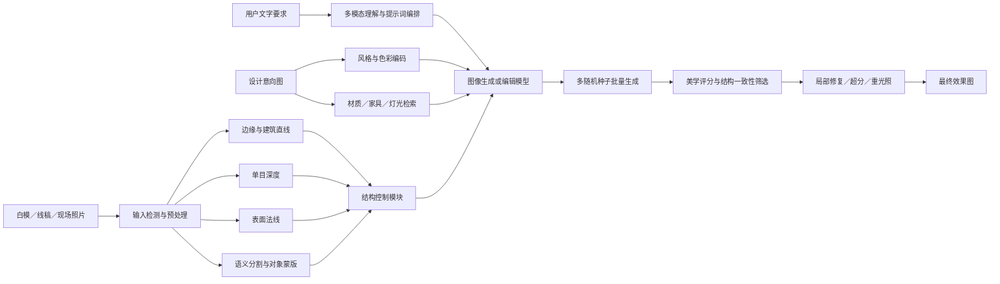

# AI 室内设计白模渲染技术实现分析

> 面向白模、线稿、现场照片和设计意向图的结构可控生成  
> 更新日期：2026 年 7 月 29 日

## 摘要

当前市面上的“白模渲染”“草图转效果图”“意向图生方案”等 AI 室内设计功能，多数并不是把输入图片自动转换成一个完整、可编辑、尺寸准确的三维模型，再执行传统物理渲染。其主流实现是：

1. 从白模、线稿或照片中提取边缘、直线、深度、法线和语义区域；
2. 将这些信息作为空间结构约束输入图像生成模型；
3. 从文字和设计意向图中提取风格、材质、色彩、家具与灯光特征；
4. 在保持当前视角和主要轮廓的前提下，对画面进行生成式重绘；
5. 通过局部蒙版、自动分割和 Inpainting 完成材质替换与区域修改；
6. 对多张候选图执行超分辨率、细节修复、美学评分和自动筛选。

因此，这类工具的核心可以概括为：

> **二维结构控制 + 参考图风格控制 + 室内领域模型 + 局部生成式编辑 + 后处理筛选。**

对于概念设计、风格探索、材料对比和客户沟通，这条路线速度快、成本低、视觉表现丰富；但它通常不能直接保证毫米级尺寸、真实材料参数、多视角一致性和施工可落地性。

---

## 1. 问题背景

示例界面中的功能来自暗壳 AI 的“白模渲染”。其官方描述为：针对白模、线稿或照片控制空间结构，并通过平台风格或用户上传的设计意向图生成多种设计表达。

这里的“暗壳风格”应理解为暗壳平台提供的预设风格能力，可能由室内案例数据、提示词模板、风格适配器、专用模型和美学筛选规则共同构成，并不是行业通用的“暗壳渲染算法”。

暗壳公开材料提到其使用多模态美学模型、空间风格模型、控制生成模型、美学评分模型和 RAG 检索模型，但并未公开完整的网络结构、训练数据组成、模型权重及推理工作流。因此，本文对暗壳具体实现的描述属于基于公开信息和行业通用技术路线的分析，不代表对其内部代码的确认。

---

## 2. 它本质上做了什么

一张白模图同时包含两类信息：

- **需要保留的信息**：相机视角、透视关系、墙体轮廓、吊顶、门窗、柜体、家具位置和空间层次；
- **需要重新生成的信息**：材料、颜色、灯光、软装、纹理、环境氛围和照片级细节。

AI 系统需要把这两类信息分开处理：

```text
白模的几何与构图  →  作为结构条件，尽量保留
文字与意向图风格  →  作为视觉条件，指导重新绘制
```

生成模型并不是直接在原图上执行传统意义的“贴图”。它通常先把图片编码到潜空间，在多步去噪过程中不断参考结构条件、文字条件和意向图条件，最后生成一张新的效果图。

这也是为什么输出能够在几秒到几十秒内呈现完全不同的材质和氛围，同时又可能出现窗户变形、灯具增减、柜体线条漂移等问题。

---

## 3. 完整技术架构



工程上通常还包括任务队列、GPU 调度、图片存储、内容安全检测、版本管理、生成历史和计费系统。

---

## 4. 不同输入是怎样被处理的

### 4.1 白模截图

白模具有干净的几何边界和明确的明暗层次，是最适合结构控制的输入之一。系统通常提取：

- Canny 或 HED 边缘；
- Lineart 建筑线稿；
- MLSD 建筑直线；
- 深度图；
- 表面法线图；
- 墙、顶、地、门窗、柜体和家具区域。

如果白模来自 SketchUp、3ds Max、Blender、Rhino 等三维软件，更专业的流程会直接从三维场景输出以下辅助通道：

- Z-Depth；
- Normal；
- Object ID；
- Material ID；
- Ambient Occlusion；
- Shadow；
- Diffuse Color。

直接输出的通道比从一张图片中反向估计更准确，也更适合同时控制材质、光影和局部对象。

### 4.2 手绘线稿或 CAD 线稿

线稿中缺少材质、真实光影和可靠的深度信息，因此主要依赖：

- Scribble 或 Lineart 控制；
- 建筑直线检测；
- 消失点和透视估计；
- 房间类型识别；
- 根据线条关系推断粗略深度。

线稿越清晰、透视越合理、闭合关系越完整，生成结果越稳定。如果线稿中存在大量辅助线、标注文字和尺寸线，通常需要先清理，否则模型可能将其误解为墙缝、灯带或装饰线。

### 4.3 现场照片或毛坯房照片

照片包含真实透视和光照，但也包含原有家具、杂物、反射和遮挡。常见处理包括：

- 单目深度估计；
- 房间布局估计；
- 墙、顶、地、门窗等语义分割；
- 原家具检测和移除；
- 用户保留对象识别；
- 空白区域补全；
- 光照和白平衡归一化。

在“保留硬装、只换软装”和“完全重新设计”之间，系统会使用不同的重绘强度及蒙版范围。

### 4.4 设计意向图

意向图主要提供视觉参考，而不是空间几何。系统通常从中提取：

- 风格类别；
- 主色、辅助色和色彩占比；
- 木材、石材、玻璃、金属、布艺等材质倾向；
- 家具轮廓和造型语言；
- 软装密度；
- 灯光色温、亮度和对比度；
- 构图、摄影镜头及后期调色特征。

如果系统不对“风格”和“内容”进行解耦，意向图里的沙发、窗户甚至房间布局也可能被带入输出，造成结构漂移。因此，专业产品通常会分别控制“参考风格强度”和“参考内容强度”。

---

## 5. 空间结构控制的实现

### 5.1 边缘控制

边缘图可以保持物体的外轮廓和局部细节。常见方法包括：

- **Canny**：线条清晰、参数简单，但容易把过多细节一起锁死；
- **HED/SoftEdge**：轮廓更柔和，允许模型进行适度设计变化；
- **Lineart**：适合草图、白模和建筑效果图；
- **MLSD**：重点提取墙、梁、窗、柜体等建筑直线。

边缘控制过强时，最终效果图可能保留白模的生硬线条，材质显得像附着在模型表面；控制过弱时，则容易改变家具与柜体结构。

### 5.2 深度控制

深度图记录每个像素相对相机的远近关系。它可以帮助生成模型保持：

- 前后遮挡；
- 墙体与家具的距离关系；
- 空间开间感；
- 近大远小的透视表现；
- 吊顶、柜体和桌椅的体积。

深度控制比单纯边缘控制更允许模型改变表面细节，适合从白模生成不同材料和风格。但单张图片得到的是相对深度，不等于真实建筑尺寸。

### 5.3 法线控制

法线图描述表面朝向，有助于：

- 保持墙面、顶面和家具表面的方向；
- 生成较合理的高光和阴影；
- 表现木材、石材、金属等不同反射特征；
- 减少平面和曲面被误判。

法线通常与深度或边缘组合使用，很少单独承担全部结构控制。

### 5.4 语义分割控制

语义分割将画面划分为墙、顶、地面、窗、门、柜体、沙发、桌椅等区域。它可以防止系统把“地板材质”生成到墙上，也为局部材料替换提供基础。

产品中常见的“点击墙面”“框选柜体”“编号替换材质”，底层一般就是用户交互加自动分割模型生成蒙版。

### 5.5 多条件组合

高质量室内设计生成通常不会只依赖一种条件，而会采用类似组合：

```text
深度：控制空间体积和前后关系
直线：锁定建筑轮廓与透视
语义分割：确定各区域的功能
法线：辅助材质和光照表现
原图低强度输入：保留整体构图
```

每一种条件都有独立权重，并且可能只在生成过程的部分阶段生效。例如，前期强力锁定大结构，后期逐渐放松控制，让模型补充纹理和软装细节。

---

## 6. 风格、材质与意向图控制

### 6.1 图像参考编码

意向图会先通过视觉编码器转换成向量特征，再通过 IP-Adapter、参考注意力或模型原生的多图参考模块输入生成模型。

这种方式与简单的颜色迁移不同。它可以影响：

- 整体设计语言；
- 材质组合；
- 家具和灯具造型；
- 画面色调；
- 摄影与后期风格。

但参考权重过高时，模型可能复制意向图的内容，而不仅是学习其风格。

### 6.2 预设风格模型

平台中的“现代极简”“侘寂”“法式中古”“轻奢”等预设，可能由以下一种或多种方式构成：

1. 固定提示词、负面提示词和生成参数；
2. LoRA 或其他轻量风格适配器；
3. 在室内设计案例上微调的专用生成模型；
4. 通过参考图检索获得的风格样本；
5. 专业设计师整理的材料、色彩和软装规则；
6. 生成后美学评分与人工偏好排序。

因此，垂直室内设计平台的优势不一定只来自一个更大的基础模型，更多时候来自高质量行业数据、经过验证的工作流和设计师反馈闭环。

### 6.3 RAG 与素材检索

当用户提出“浅色洞石墙面、胡桃木柜体、米白色布艺沙发”时，系统可以先在材料库、家具库和案例库中检索匹配对象，再把检索结果作为图像参考或文字描述送入生成模型。

如果平台与真实商品库连接，检索结果还可以携带：

- 商品编号；
- 品牌和规格；
- 材质参数；
- 价格；
- 三维模型；
- 可采购状态。

这条路线比完全由生成模型凭空绘制更接近“所见即所得”，也是室内 AI 从概念出图走向交易和交付的重要环节。

---

## 7. 生成与“裂变”的实现

所谓“一张白模裂变多个方案”，通常并不意味着系统重新理解了多个完全不同的空间方案，而是保持结构条件基本不变，改变以下变量：

- 随机种子；
- 风格预设；
- 颜色组合；
- 参考图权重；
- 结构控制权重；
- 重绘强度；
- 提示词中的材料、家具和灯光描述；
- 候选模型或风格适配器。

例如，同一张白模可以在固定相机和深度图的前提下，分别生成：

- 浅木色现代极简；
- 深色中古；
- 暖灰侘寂；
- 白色法式；
- 石材与金属轻奢。

系统批量生成多张候选图后，再根据美学分数、结构相似度、提示词符合度和图像质量自动排序。

### 7.1 常见控制参数的实际含义

| 产品界面用语 | 底层可能对应的参数 |
|---|---|
| 结构保持／结构强度 | ControlNet 或结构参考权重 |
| 创意强度 | 去噪或重绘强度 |
| 风格强度 | 图像参考、IP-Adapter 或风格适配器权重 |
| 原图相似度 | Image-to-Image 输入权重 |
| 材质保持 | 局部蒙版、参考纹理或材料条件权重 |
| 多方案生成 | 批量随机种子和提示词变体 |
| 高清／超清 | 超分辨率和二次细化 |

各个平台对参数的定义并不完全一致，不能简单地把一个产品中的“结构强度 80”换算成另一个产品的相同数值。

---

## 8. 多材质替换与局部编辑

多材质替换通常包含以下步骤：

1. 用户点击、框选、涂抹或用编号指定区域；
2. 分割模型生成精确蒙版；
3. 对蒙版边缘执行扩张、羽化和保边处理；
4. 根据文字或参考材质图执行局部 Inpainting；
5. 保留原区域的透视、明暗和遮挡关系；
6. 进行颜色匹配、阴影融合和边缘修复。

例如，把电视背景墙从乳胶漆改为洞石，系统不只是改变颜色，还需要生成：

- 洞石纹理；
- 合理的纹理尺寸；
- 石材分缝；
- 阴角与阳角；
- 灯带照射后的明暗变化；
- 与柜体、地面之间的接触阴影。

纯生成式系统可以生成“看起来合理”的效果，但不一定遵守真实石材规格和施工节点。若要准确落地，需要引入真实材料库、PBR 贴图、铺贴规则和三维几何。

---

## 9. 后处理与质量筛选

初次生成通常不是最终交付图。平台可能继续执行：

- 超分辨率放大；
- 纹理和材质细化；
- 灯具、植物、玻璃等局部修复；
- 畸变和重复物检测；
- 结构相似度比较；
- 美学评分；
- 提示词符合度评分；
- 人脸、文字和水印检测；
- 色彩和曝光统一；
- 锐化、降噪和压缩。

室内场景中容易出错的对象包括：

- 吊灯连接位置；
- 椅腿和桌腿数量；
- 镜面反射；
- 玻璃边界；
- 重复摆件；
- 窗外景观；
- 柜门缝和拉手；
- 踢脚线及阴角；
- 不符合透视的纹理尺度。

成熟产品会针对这些高频问题加入专门的检测和二次修复流程。

---

## 10. 市面产品的三种主要路线

### 10.1 纯二维生成式路线

代表形态包括白模转效果图、草图渲染和照片改造类产品。

**工作方式：**

- 上传一张图片；
- 提取结构控制条件；
- 加入文字或风格参考；
- 直接生成新的效果图。

**优势：**

- 速度快；
- 使用门槛低；
- 风格丰富；
- 适合概念阶段批量探索。

**局限：**

- 结构只能“尽量保持”；
- 尺寸无法作为施工依据；
- 输出通常只是二维图片；
- 多视角容易不一致；
- 生成家具不一定能采购。

### 10.2 原生三维设计与物理渲染路线

代表形态包括带户型编辑器、家具模型库和材质库的在线三维设计平台。

**工作方式：**

- 识别或绘制户型；
- 在三维场景中布置真实模型；
- 使用 PBR 材质、灯光和渲染器出图；
- AI 辅助布局、选品、材质推荐和渲染增强。

**优势：**

- 空间尺寸和视角更稳定；
- 家具、材质和灯光可编辑；
- 可生成多个一致视角；
- 容易连接商品、报价和施工数据。

**局限：**

- 需要建立或匹配三维模型；
- 创意探索速度可能慢于纯图片生成；
- 特殊造型仍需要人工建模；
- 依赖素材库完整度。

### 10.3 三维与生成式 AI 混合路线

这是更适合专业室内设计的方向。

**典型流程：**

```text
精确三维白模
  ↓
输出深度、法线、材质 ID 和基础灯光
  ↓
生成模型负责材质创意、软装和氛围
  ↓
人工确认方案
  ↓
回到三维场景替换真实材料和产品
  ↓
物理渲染与施工深化
```

**优势：**

- 兼顾结构准确和生成式创意；
- 适合设计师现有软件工作流；
- 能够保留可编辑性；
- 更容易完成多视角一致输出。

**局限：**

- 系统复杂；
- 对三维数据和模型管线要求更高；
- GPU 和存储成本较高；
- 需要解决二维结果向三维参数的回写。

---

## 11. “精准控制空间结构”的真实边界

产品宣传中的“精准控制”需要区分两个层次。

### 11.1 图像层面的结构保持

通常可以做到：

- 基本保留相机视角；
- 保留墙体、柜体和主要家具轮廓；
- 保持前后景关系；
- 保持门窗的大致位置；
- 在固定构图下更换风格与材料。

### 11.2 工程层面的几何准确

单张图片生成通常不能保证：

- 毫米级尺寸；
- 隐藏面和背面几何；
- 墙体真实厚度；
- 柜体内部结构；
- 多视角完全一致；
- 碰撞关系正确；
- 材料规格和分缝准确；
- 消防、机电和施工规范；
- 可直接统计的工程量。

因此，“结构保持”不等于“结构建模”，“照片级效果”也不等于“可施工方案”。

---

## 12. 如何判断一款产品属于哪条路线

可以使用以下问题进行快速判断：

1. 输出只有 PNG/JPG，还是同时生成可编辑三维场景？
2. 能否在同一空间中切换多个相机并保持设计一致？
3. 墙、地、柜体是否可以被单独选择和修改？
4. 家具是否来自真实模型与商品库？
5. 材质是否包含尺寸、铺贴、凹凸、粗糙度等 PBR 参数？
6. 修改一个区域时，其他区域是否保持不变？
7. 能否返回 SketchUp、3ds Max、CAD、BIM 或平台三维工具继续编辑？
8. 能否输出材料清单、商品清单或工程量？

如果产品只能上传图片并返回几张效果图，它大概率属于二维生成式路线。  
如果能够持续编辑空间对象、材质和相机，它更可能包含原生三维场景。  
如果两种能力都有，则可能采用三维与生成式 AI 的混合路线。

---

## 13. 如果自行开发，建议的系统拆分

### 13.1 最小可用版本

一个可运行的白模渲染 MVP 可以由以下模块组成：

| 模块 | 主要能力 |
|---|---|
| 输入预处理 | 尺寸归一化、裁切、曝光与噪声处理 |
| 结构提取 | Canny、Lineart、MLSD、Depth、Normal |
| 区域分割 | 墙、顶、地、门窗、柜体和家具蒙版 |
| 风格控制 | 文字提示词、参考图编码、风格预设 |
| 图像生成 | 支持结构条件的生成或编辑模型 |
| 局部重绘 | 蒙版编辑、材质替换和对象增删 |
| 后处理 | 超分辨率、锐化、细节修复 |
| 质量评估 | 美学评分、结构相似度和异常检测 |
| 工程服务 | GPU 队列、存储、任务状态和版本记录 |

### 13.2 推荐的产品迭代顺序

1. 先做好单张白模、固定视角的结构保持；
2. 增加预设室内风格和参考图；
3. 增加墙、地、顶、柜体的区域选择；
4. 增加多材质替换和局部重绘；
5. 增加真实材料和商品检索；
6. 接入三维软件，直接读取深度、法线和对象 ID；
7. 解决同一空间多视角一致性；
8. 将确认后的二维方案回写为可编辑三维参数。

真正影响产品体验的往往不是“是否接入一个大模型”，而是：

- 输入图是否被正确识别；
- 默认参数是否适合室内场景；
- 局部修改是否稳定；
- 生成错误能否快速修正；
- 结果是否能回到设计工作流继续落地。

---

## 14. 对设计工作的合理定位

### 适合使用 AI 白模渲染的阶段

- 前期创意发散；
- 风格与材料方向对比；
- 与客户快速沟通；
- 设计提案和情绪板；
- 软装与色彩探索；
- 低成本制作营销图；
- 在正式建模前验证视觉方向。

### 不应直接替代的工作

- 精确户型和结构设计；
- 深化施工图；
- 定制柜体拆单；
- 机电、消防和规范校核；
- 材料算量和报价；
- 真实光照计算；
- 最终材料封样；
- 多视角一致的正式交付。

推荐工作流是：

> **三维结构负责准确，生成式 AI 负责创意，真实产品库负责可采购，传统设计与渲染流程负责最终落地。**

---

## 15. 结论

市面上的 AI 白模渲染，本质上是一个多模型协作系统，而不是单一的“图片滤镜”：

- 视觉模型识别空间；
- 深度、边缘、法线和分割模型约束结构；
- 多模态模型理解文字与参考图；
- 生成模型完成材质、软装和灯光重绘；
- 分割与 Inpainting 支持局部修改；
- 行业数据、素材检索和美学评分提高专业度；
- 三维系统则负责尺寸、可编辑性和最终落地。

对于纯图片工具，“精准控制”主要是当前视角下的视觉结构保持；对于三维或混合型平台，才可能进一步实现多视角一致、对象级编辑、真实材料替换和工程数据连接。

未来更有价值的方向不是单纯追求“更快出一张漂亮图片”，而是把 AI 生成的设计意图可靠地转化为可编辑、可采购、可报价、可施工的空间方案。

---

## 参考资料

1. [暗壳 AI：白模渲染与空间设计技能](https://www.ark.art/workbench/)
2. [ControlNet：Adding Conditional Control to Text-to-Image Diffusion Models](https://arxiv.org/abs/2302.05543)
3. [Adobe Firefly：Structure Image Reference](https://developer.adobe.com/firefly-services/docs/firefly-api/guides/concepts/structure-image-reference/)
4. [Adobe Firefly：Style Reference Images](https://helpx.adobe.com/firefly/web/work-with-images/generate-images/reference-images-for-styling.html)
5. [IP-Adapter：Text Compatible Image Prompt Adapter](https://ip-adapter.github.io/)
6. [Segment Anything，Meta AI](https://ai.meta.com/research/publications/segment-anything/)
7. [MiDaS：Robust Monocular Depth Estimation](https://github.com/isl-org/MiDaS)
8. [LookX AI：Architecture and Interior Design Generation](https://dev.lookx.ai/)
9. [酷家乐 AI 绘图](https://open.kujiale.com/festatic/aidraw)
10. [酷家乐智能设计](https://www.kujiale.com/festatic/IntelligentDesign)
11. [Homestyler 3D Floor Planner](https://www.homestyler.com/solution/design_floor-planner)

