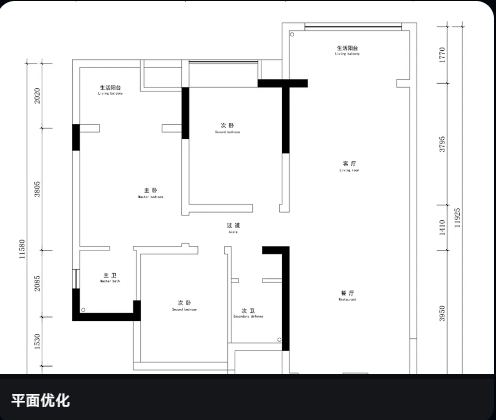
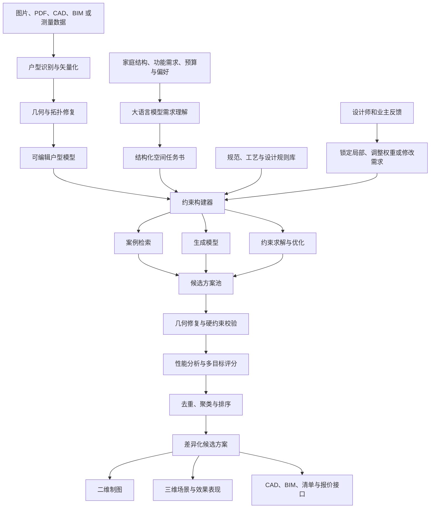

# AI 家装平面布局：实现原理、技术架构与落地方案

> 文档版本：1.0  
> 编写日期：2026-07-29  
> 适用对象：室内设计师、家装产品经理、算法工程师、软件架构师及相关业务负责人

## 摘要

AI 家装平面布局的目标，是根据原始户型、建筑条件、居住需求和设计偏好，自动完成户型诊断、空间功能配置、候选方案推演、量化评估和可视化表达，为设计师与业主提供直观、可讨论、可继续编辑的布局参考。

目前较可靠的产品通常不是由一个大模型直接“画出平面图”，而是采用混合技术体系：

> 计算机视觉负责读图，大语言模型负责理解需求，几何与规则引擎负责保证方案成立，生成或优化算法负责探索方案，CAD/BIM 与渲染引擎负责输出结果，设计师负责最终判断。

其核心计算过程可以概括为：

```text
建筑边界 B
+ 固定结构 F
+ 空间需求 R
+ 设计约束 C
+ 评价目标 O
        ↓
生成候选布局 {L₁, L₂, ... Lₙ}
        ↓
硬约束验证与几何修复
        ↓
多目标评分、聚类与排序
        ↓
输出若干有明显差异的可编辑方案
```

本文结合示例图，对这类系统的一般实现方式、算法路线、工程架构、评价体系、产品边界和落地步骤进行完整说明。

---

## 1. 示例与业务场景

示例户型图：



图中包含较清晰的：

- 户型外轮廓；
- 内外墙体和局部结构；
- 门窗洞口；
- 房间名称；
- 尺寸标注；
- 主卧、次卧、客厅、餐厅、厨房、卫生间等功能分区。

这类输入比拍照图、低清扫描图或者手绘草图更容易处理，因为墙线规则、文字清晰，并且能够利用尺寸标注校准比例。

典型产品使用流程如下：

1. 用户上传原始户型图、CAD 或测量数据；
2. 系统识别墙体、门窗、柱、管井及房间；
3. 用户校正识别结果并标记不可拆结构；
4. 用户输入家庭成员和空间需求；
5. 系统诊断现有户型问题；
6. 系统生成若干平面布局候选方案；
7. 用户调整设计偏好或锁定部分空间；
8. 系统进行局部重算；
9. 设计师与业主对比方案并继续编辑；
10. 输出二维图、三维场景和后续施工设计所需的基础数据。

---

## 2. 当前主流产品的技术本质

很多产品将能力统称为“AI 户型设计”，但内部通常包含不同程度的自动化。常见实现可以分为三个层级。

### 2.1 辅助型：识图、诊断和智能推荐

系统自动识别房间和家具，给出类似以下建议：

- 玄关缺少收纳；
- 客餐厅动线过长；
- 主卧衣柜容量不足；
- 餐桌与厨房距离偏远；
- 卫生间门正对公共空间；
- 某一房间采光条件较弱。

这一层并不一定真正改变墙体或重新求解空间，只需要完成户型结构化、规则检测和案例推荐。

### 2.2 半自动型：模板匹配与局部替换

系统从案例库中检索相似户型或相似房间，对模板进行缩放、变形和局部替换，然后用规则引擎校正家具碰撞、门扇开启和通道尺寸。

这种方式响应快、稳定性较高，适合标准化住宅和家具布置，但容易产生同质化结果，对异形户型、复杂改造和强个性化需求适应性较弱。

### 2.3 生成优化型：约束驱动的方案推演

系统将墙体、房间和家具视为可计算对象，在建筑边界和设计约束内搜索大量布局，并对候选方案进行评价与排序。

这才是严格意义上的“平面方案生成”。它可能使用传统优化算法、深度生成模型，或者二者结合。

实际商业产品经常同时采用以上三层：

- 简单问题走规则和模板，提高速度与稳定性；
- 非标准问题调用生成模型提出候选；
- 最终统一交由几何引擎修复和验证。

---

## 3. 第一阶段：户型图识别与矢量化

### 3.1 输入形式

系统可能接收：

- PNG、JPG 等图片；
- 扫描版 PDF；
- 矢量 PDF；
- DWG、DXF 等 CAD 文件；
- IFC、RVT 等 BIM 数据；
- 激光测距仪或 LiDAR 扫描结果；
- 移动端现场测量数据；
- 用户手绘草图。

输入质量决定了后续自动化上限。CAD、BIM 和带尺寸的清晰平面图通常最可靠；没有比例尺、存在透视变形的现场照片最难处理。

### 3.2 图像预处理

对于位图户型图，通常先执行：

- 去噪与锐化；
- 二值化；
- 透视矫正；
- 图纸方向判断；
- 线宽归一化；
- 图框、标题栏和无关标记清除；
- 分辨率与比例尺估计。

### 3.3 建筑构件识别

常用计算机视觉任务包括：

| 对象 | 常用技术 | 输出结果 |
|---|---|---|
| 墙体 | 语义分割、线段检测、骨架提取 | 中心线、边界、厚度 |
| 门窗 | 目标检测、符号识别、局部拓扑分析 | 类型、坐标、宽度、方向 |
| 柱与管井 | 实例分割、图形模板匹配 | 轮廓、类别、是否固定 |
| 房间 | 闭合区域检测、分割模型 | 房间多边形 |
| 房间名称 | OCR、文本分类 | 名称、功能标签 |
| 尺寸标注 | OCR、尺寸线关联 | 数值、对应线段 |
| 家具 | 目标检测、图块匹配 | 家具类型、位置、朝向 |

### 3.4 比例尺与真实尺寸恢复

如果图中有明确尺寸，系统会将 OCR 读到的数值与对应尺寸线关联，计算：

```text
比例尺 = 标注的真实长度 ÷ 图像中的像素长度
```

系统一般需要使用多组尺寸交叉校验，并检测：

- OCR 数值是否识别错误；
- 尺寸线端点是否关联正确；
- 图纸是否被非等比缩放；
- 横向和纵向比例是否一致；
- 局部尺寸与总尺寸是否矛盾。

如果没有尺寸，可让用户在图上选择两个点并输入实际距离，完成比例校准。

### 3.5 几何与拓扑修复

视觉模型的结果通常不能直接用于设计计算，需要进行确定性修复：

- 合并接近共线的墙段；
- 吸附相邻墙体端点；
- 封闭微小缺口；
- 去除重复线和孤立短线；
- 将门窗绑定到所属墙体；
- 构建房间闭合多边形；
- 判断相邻房间和可达关系；
- 将墙体内外侧统一到一致的拓扑结构。

最终输出的不是一张图片，而是一份可计算的户型场景图。

---

## 4. 户型的结构化数据模型

### 4.1 基本对象

一个简化的户型模型可以包含：

```json
{
  "scale": 0.01,
  "boundary": [],
  "walls": [],
  "openings": [],
  "columns": [],
  "shafts": [],
  "rooms": [],
  "furniture": [],
  "constraints": []
}
```

墙体示例：

```json
{
  "id": "wall_102",
  "start": [3.2, 1.8],
  "end": [8.4, 1.8],
  "thickness": 0.24,
  "structural": true,
  "demolishable": false
}
```

房间示例：

```json
{
  "id": "room_07",
  "type": "master_bedroom",
  "polygon": [],
  "area": 18.6,
  "windows": ["window_12"],
  "doors": ["door_09"],
  "daylight_score": 0.82
}
```

### 4.2 空间关系图

除了几何坐标，还会构建空间关系图：

- 节点：房间、入口、阳台、管井等；
- 边：相邻、连接、可见、接近、必须远离等关系；
- 节点属性：功能、面积、采光、私密性、噪声等级；
- 边属性：关系类型、优先级、期望距离。

例如：

```text
玄关 ─ 客厅 ─ 阳台
          │
        餐厅 ─ 厨房

主卧 ─ 主卫
次卧 ─ 公卫
```

这种图结构非常适合表达“厨房靠近餐厅”“主卫服务主卧”“卧室远离入户视线”等设计关系。

---

## 5. 第二阶段：居住需求理解与约束建模

### 5.1 大语言模型的主要作用

大语言模型更适合负责：

- 理解用户的自然语言需求；
- 追问缺失信息；
- 将模糊偏好转成参数；
- 根据家庭结构推荐需求优先级；
- 调用布局、分析和渲染模块；
- 比较不同方案并解释取舍；
- 将设计指标转成业主容易理解的语言。

例如：

> 三口之家，偶尔有老人过夜；想要开放厨房，但担心油烟；主卧要更多衣柜；尽量少拆墙。

可以转换为：

```json
{
  "household": {
    "adults": 2,
    "children": 1,
    "guest_frequency": "occasional"
  },
  "spaces": {
    "bedrooms": 3,
    "bathrooms": 2,
    "kitchen": "semi_open"
  },
  "priorities": {
    "master_storage": 0.9,
    "construction_cost": 0.85,
    "public_space": 0.7
  },
  "constraints": {
    "retain_major_walls": true,
    "keep_wet_areas_near_shafts": true
  }
}
```

### 5.2 硬约束与软约束

必须把需求分成两类。

#### 硬约束

违反后方案直接淘汰，例如：

- 不得移动承重墙、柱、烟道或公共管井；
- 房间和家具不能穿过墙体；
- 门窗不得脱离墙体；
- 主要房间必须可达；
- 门扇开启不能产生严重碰撞；
- 卫生间必须满足基本设备与通道尺寸；
- 湿区移动范围受到排水条件限制；
- 某些房间必须有自然采光或通风；
- 必须遵守明确适用的法规和项目条件。

#### 软约束

允许权衡，通过评分表达，例如：

- 厨房尽量靠近餐厅；
- 主卧尽量远离入户门；
- 儿童房尽量接近主卧；
- 餐桌尽量不占主要通道；
- 走廊面积尽量小；
- 储物量尽量大；
- 改造成本尽量低；
- 公共空间尽量开敞。

如果不区分硬、软约束，系统容易因为条件冲突而无解，或者输出形式正确但体验很差的方案。

### 5.3 约束来源

约束通常来自：

- 建筑结构数据；
- 国家、地区及项目适用规范；
- 室内设计经验规则；
- 家具和设备产品尺寸；
- 企业自身的标准化工艺；
- 业主的明确要求；
- 从历史优秀案例中学习到的统计规律。

规范和工程条件应以结构化规则库实现，不能完全依赖大语言模型临时回忆。

---

## 6. 第三阶段：平面方案生成

### 6.1 路线一：案例检索与模板变形

系统从历史案例库中检索：

- 建筑面积相近；
- 户型外轮廓相近；
- 入户位置相近；
- 门窗和管井位置相近；
- 房间数量与功能需求相近；
- 改造限制相近的案例。

然后执行：

- 模板缩放；
- 房间边界调整；
- 家具替换；
- 门洞微调；
- 局部墙线适配；
- 几何修复和规则校验。

优点：

- 生成速度快；
- 结果接近真实设计案例；
- 质量容易控制；
- 适合标准户型和标准家具布置。

缺点：

- 对案例库覆盖度依赖很强；
- 容易输出相似方案；
- 很难处理前所未见的异形边界；
- 可能只是在“套模板”，而非真正求解。

### 6.2 路线二：程序化生成与约束求解

将每个空间表示为矩形、多边形或可组合模块，定义：

- 空间坐标；
- 长宽和面积范围；
- 朝向；
- 邻接关系；
- 门的位置；
- 与外墙、窗、管井的距离；
- 家具摆放区域。

然后使用：

- 约束满足问题（CSP）；
- SAT/SMT 求解；
- 混合整数规划（MIP）；
- 矩形装箱与空间切分；
- 搜索与回溯；
- 规则驱动的程序化生成。

该路线的优势是规则清晰、结果可解释，适合精确处理硬约束；劣势是复杂户型下变量和组合数量会快速增加。

### 6.3 路线三：启发式与多目标优化

先产生一个可行布局，然后不断执行局部操作：

- 移动隔墙；
- 交换两个房间；
- 改变房间长宽；
- 调整门洞；
- 合并或拆分空间；
- 调整家具位置和朝向。

根据评分决定是否保留新的布局。常见算法包括：

- 遗传算法；
- 模拟退火；
- 粒子群优化；
- 贝叶斯优化；
- 强化学习；
- NSGA-II 等多目标优化方法。

它们适合同时处理动线、采光、面积、收纳和成本等互相竞争的目标。

### 6.4 路线四：深度生成模型

深度模型可以学习真实户型的统计规律，并根据条件生成新布局。

常见技术包括：

- 图神经网络；
- 条件 GAN；
- Transformer；
- 扩散模型；
- 自回归矢量生成；
- 神经网络与强化学习结合。

典型条件包括：

- 建筑外轮廓；
- 房间数量和类型；
- 房间邻接图；
- 面积区间；
- 门窗与入口位置；
- 已锁定的部分布局。

研究项目 Graph2Plan 将建筑边界与布局关系图转换成平面；House-GAN 和 House-GAN++ 使用图约束关系生成并迭代完善房间布局。

深度模型的优点：

- 能从大量案例中学习隐含布局规律；
- 生成速度快；
- 候选方案具有一定多样性；
- 对用户条件可以实现柔性响应。

主要问题：

- 可能产生墙体不闭合；
- 房间可能重叠或出现狭长畸形；
- 门窗和通道可能不合理；
- 很难直接保证全部工程约束；
- 训练数据的地域、年代和设计偏差会传递到结果中。

因此，深度生成模型更适合作为候选方案提出器，而不是最终施工图生成器。

### 6.5 推荐的混合实现

较实际的产品架构是：

```text
案例检索提供可靠起点
        ↓
生成模型提出不同空间关系
        ↓
约束求解器生成或修正精确几何
        ↓
启发式算法继续优化软指标
        ↓
规则引擎完成最终验证
```

这样兼顾：

- 生成速度；
- 方案多样性；
- 硬约束可靠性；
- 几何精度；
- 产品可解释性。

---

## 7. 第四阶段：户型诊断、校验和评分

### 7.1 户型诊断

系统可以在生成新方案之前，对原方案进行问题检测：

- 入户缺少缓冲和收纳；
- 动静分区不明显；
- 卧室门直接暴露于公共区；
- 走廊面积占比过大；
- 家务动线过长；
- 洗衣、晾晒、收纳之间联系较弱；
- 厨房操作台连续长度不足；
- 餐桌挤占交通空间；
- 卫生间干湿分区困难；
- 家具与门窗发生冲突；
- 某些空间面积足够但形状利用率低；
- 采光较好的界面没有分配给高频空间。

每个问题都应绑定几何证据，而不是只输出泛化文案。例如：

```text
问题：餐桌侵占主通道
证据：餐桌边缘至墙体的净距为 620 mm
建议：调整餐桌方向，或将餐桌中心向厨房侧移动 300 mm
```

### 7.2 硬约束校验

候选方案首先执行布尔式校验：

```text
墙体是否闭合？
房间是否重叠？
门是否位于墙体上？
主要空间是否全部可达？
家具是否超出房间？
门扇是否发生不可接受的碰撞？
固定结构是否被修改？
```

只要关键检查失败，方案就不能进入最终候选列表。

### 7.3 软指标评分

通过归一化指标计算方案质量：

| 维度 | 示例指标 |
|---|---|
| 空间效率 | 使用面积占比、走廊面积、畸形空间面积 |
| 动线 | 入户至客厅距离、厨餐距离、家务路径 |
| 采光通风 | 外窗长度、窗地比、主要空间采光潜力 |
| 私密性 | 入户视线、卧室与公共区暴露程度 |
| 收纳 | 柜体长度、储物体积、入口与卧室收纳覆盖 |
| 家具可用性 | 净距、开门空间、家具完整性 |
| 改造成本 | 拆墙量、新建墙量、门洞变化、湿区移动 |
| 需求匹配 | 房间数量、面积偏差、邻接关系满足度 |

一个简化的评分形式：

```text
Score(L) =
  w₁ × 动线得分
+ w₂ × 采光得分
+ w₃ × 空间利用率
+ w₄ × 收纳得分
+ w₅ × 私密性得分
+ w₆ × 需求匹配度
- w₇ × 改造成本
- w₈ × 规则惩罚
```

权重不应固定不变，而应根据用户偏好调整。例如：

- 预算优先：提高改造成本权重；
- 二孩家庭：提高卧室数量、收纳和家庭互动权重；
- 适老家庭：提高无障碍、通道和夜间动线权重；
- 改善型住宅：提高公共空间、套房和私密性权重。

### 7.4 多目标优化与帕累托方案

平面设计经常存在相互冲突的目标：

- 公共空间扩大，可能压缩卧室面积；
- 增加收纳，可能牺牲通道宽度；
- 少拆墙，可能限制功能改善；
- 开放厨房改善空间感，但可能增加油烟影响。

因此系统不应只给出一个“综合分最高”的结果，而应保留若干帕累托最优方案：

- 方案 A：最少拆改；
- 方案 B：收纳最大化；
- 方案 C：公共空间最大化；
- 方案 D：私密性最佳；
- 方案 E：增加独立功能房。

这些方向清晰的方案比五个高度相似的结果更有讨论价值。

---

## 8. 第五阶段：结果表达与可编辑输出

### 8.1 二维平面图

系统可以自动绘制：

- 原始户型图；
- 平面布置图；
- 拆墙图；
- 新建墙体图；
- 家具尺寸图；
- 动线分析图；
- 收纳分析图；
- 采光与通风分析图；
- 方案差异对比图。

### 8.2 三维场景

确定二维空间关系后，可以自动：

1. 拉伸墙体；
2. 创建门窗洞口；
3. 匹配家具模型；
4. 根据房间类型应用材质和灯光；
5. 生成相机机位；
6. 输出效果图、全景图或漫游。

### 8.3 CAD/BIM 输出

高价值产品应尽量保留对象语义，而不是只输出一张图片。理想输出包括：

- 可编辑墙体；
- 可编辑门窗；
- 房间多边形及面积；
- 家具和设备对象；
- 尺寸标注；
- 图层、材质和构件属性；
- DWG、DXF、IFC 或产品内部场景格式。

只有当结果保持几何结构和对象语义时，才能继续进入深化设计、算量、报价和施工图阶段。

### 8.4 生成式效果图的作用边界

扩散模型适合：

- 快速表达空间气氛；
- 尝试材质和风格；
- 生成概念效果图；
- 帮助业主理解设计方向。

但不适合单独承担：

- 精确平面求解；
- 尺寸计算；
- 门窗和墙体一致性；
- 施工图输出；
- 结构和规范校验。

一张看起来合理的 AI 图片，不等于一个几何上正确、工程上可落地的方案。

---

## 9. 推荐系统架构



### 9.1 主要服务模块

| 模块 | 主要职责 |
|---|---|
| 输入解析服务 | 处理图片、PDF、CAD、BIM |
| 户型识别服务 | 墙体、门窗、文字、尺寸和房间识别 |
| 几何内核 | 矢量计算、布尔运算、拓扑、碰撞检测 |
| 需求理解服务 | 将对话转换为空间任务书 |
| 规则中心 | 管理设计规则、规范、企业工艺 |
| 案例检索服务 | 相似户型与优秀方案搜索 |
| 方案生成器 | 生成空间关系与初始几何 |
| 优化求解器 | 约束求解和多目标优化 |
| 分析评价服务 | 动线、采光、收纳、成本等指标 |
| 制图服务 | 绘制墙体、家具、标注和分析图 |
| 三维场景服务 | 创建模型、材质、灯光和相机 |
| 版本与反馈系统 | 保存方案树、锁定对象和迭代历史 |

---

## 10. 交互方式设计

### 10.1 需求采集

系统应引导用户填写或对话确认：

- 常住人口及年龄；
- 是否需要老人房、儿童房或客房；
- 居家办公频率；
- 烹饪方式和厨房开放程度；
- 卫生间数量及干湿分离需求；
- 收纳强度；
- 洗衣晾晒习惯；
- 宠物需求；
- 是否保留现有家具；
- 可接受的拆改量；
- 预算和风格偏好。

### 10.2 局部锁定

用户应能够锁定：

- 不可移动墙体；
- 保留房间；
- 已确认的门窗；
- 某组家具；
- 厨卫位置；
- 某个空间面积或边界。

系统只重算未锁定部分。该能力对于设计师工作流非常重要，因为实际设计往往是逐步确认，而不是每次推倒重来。

### 10.3 可解释的方案对比

每个方案应给出：

- 主要设计策略；
- 相对于原方案的变化；
- 改善的指标；
- 付出的代价；
- 仍然存在的风险；
- 建议重点讨论的问题。

示例：

```text
方案 B：收纳优先

主要变化：
- 将次卧入口向走廊侧移动；
- 增加主卧整墙衣柜；
- 在餐厅侧增加家政柜。

改善：
- 柜体有效长度增加 4.2 m；
- 入户收纳得到补充；
- 主卧视线更加完整。

代价：
- 餐厅净宽减少 180 mm；
- 新建墙体增加约 3.6 m；
- 需要进一步复核门洞位置。
```

---

## 11. 结合示例图的可能处理流程

针对本文示例图，系统可以按以下顺序处理。

### 11.1 识别现有结构

1. 根据外围尺寸恢复比例；
2. 提取外墙和室内主要墙体；
3. 识别黑色实体构件及其连续关系；
4. 识别主卧、次卧、客厅、餐厅、厨房和卫生间文字；
5. 检测门窗洞口；
6. 构建房间闭合区域；
7. 计算各空间面积和开间进深；
8. 让设计师确认哪些墙体不可拆。

### 11.2 建立功能关系

根据已有标注构建：

- 主卧与相邻卫生间的服务关系；
- 次卧与公共卫生间的可达关系；
- 客厅、餐厅和厨房的公共活动关系；
- 过道与各卧室的交通关系；
- 外窗与主要采光空间的对应关系。

### 11.3 自动诊断

系统可进一步计算：

- 中部过道的面积占比和有效利用率；
- 客餐厅连续空间的家具布置容量；
- 厨房与餐桌之间的路径；
- 卧室入口的私密性；
- 各卧室的床、衣柜和通道净距；
- 卫生间的设备布置完整性；
- 潜在的收纳补充位置；
- 可改墙体调整后是否能获得更方正空间。

### 11.4 生成不同目标的方案

在结构数据确认后，可尝试：

- 少拆改方案；
- 客餐厅一体化方案；
- 主卧套房优化方案；
- 收纳增强方案；
- 居家办公或临时客房方案。

是否能够移动厨房、卫生间或墙体，必须根据承重、排水、燃气、烟道、防水和当地项目条件决定。

---

## 12. 产品落地建议

### 12.1 第一阶段：可用的 MVP

建议先解决：

- 清晰户型图上传；
- 半自动墙体、门窗和房间识别；
- 人工校正工具；
- 家具自动摆放；
- 基础碰撞和净距检查；
- 户型问题诊断；
- 两到三个方向明确的布局建议；
- 二维平面图和对比报告输出。

这一阶段不必立即追求任意户型的全自动拆墙改造。可靠的半自动流程往往比不稳定的“一键完成”更有产品价值。

### 12.2 第二阶段：空间级生成

增加：

- 户型案例向量检索；
- 空间关系图；
- 规则驱动的隔墙调整；
- 多目标评分；
- 局部锁定和局部重算；
- 设计师偏好学习；
- 多方案差异化控制。

### 12.3 第三阶段：设计与交付闭环

继续连接：

- 三维场景自动搭建；
- 家具和建材商品库；
- BOM 和预算估算；
- CAD/BIM 输出；
- 企业施工工艺；
- 项目版本管理；
- 设计师审核和业主在线协同。

### 12.4 技术路线优先级

如果从零开发，推荐顺序为：

1. 先做好结构化数据模型和几何内核；
2. 再建立规则库与校验系统；
3. 然后加入案例检索和参数化布局；
4. 最后用生成模型提升多样性和交互体验。

如果几何和规则基础不稳定，即使生成模型视觉效果很好，也难以形成可用于真实家装流程的产品。

---

## 13. 数据与模型建设

### 13.1 所需数据

高质量数据集应包含：

- 原始户型；
- 改造后墙体；
- 平面家具布置；
- 房间功能标签；
- 门窗、柱、管井和承重信息；
- 实际尺寸；
- 设计需求任务书；
- 设计师选择和修改轨迹；
- 方案评分或成交结果；
- 项目地域、建筑年代和家庭结构。

只有最终效果图而没有矢量墙线、尺寸和设计条件的数据，对训练精确布局模型帮助有限。

### 13.2 数据标准化

需要统一：

- 坐标系和单位；
- 房间类型字典；
- 家具分类；
- 墙体与开口表达；
- 邻接关系定义；
- 方案版本关系；
- 规则违反类型；
- 设计需求字段。

### 13.3 人类反馈

可以利用以下反馈改善系统：

- 设计师选择了哪个候选方案；
- 哪些墙体被重新调整；
- 用户修改了哪些优先级；
- 某一建议为何被否决；
- 最终落地方案与生成方案的差异；
- 业主对功能、造价和视觉的评价。

这些反馈可用于：

- 排序模型训练；
- 个性化推荐；
- 规则权重校准；
- 案例库质量优化；
- 生成模型微调。

---

## 14. 效果评价指标

### 14.1 户型识别指标

- 墙体分割准确率；
- 墙体中心线偏差；
- 门窗识别准确率；
- OCR 准确率；
- 房间闭合成功率；
- 尺寸恢复误差；
- 人工校正耗时。

### 14.2 方案生成指标

- 硬约束通过率；
- 成功生成可行方案的比例；
- 平均生成时间；
- 方案之间的多样性；
- 用户需求满足率；
- 与专业设计师方案的差异；
- 设计师修改量。

### 14.3 产品指标

- 从上传到首个方案的时间；
- 用户完成需求输入的比例；
- 方案收藏或选用率；
- 设计师采纳率；
- 方案迭代次数；
- 从概念方案进入深化设计的转化率；
- 人均设计产能提升；
- 因识别或规则错误导致的返工率。

---

## 15. 主要难点与风险

### 15.1 输入图纸不可靠

低清扫描、图纸缺失、现场尺寸变化和非等比缩放都会导致识别误差。系统必须提供方便的人工校正，而不能假设识别结果天然正确。

### 15.2 承重和设备条件不完整

仅凭普通销售户型图通常不能可靠判断：

- 承重墙；
- 梁柱结构；
- 给排水立管；
- 燃气条件；
- 排烟系统；
- 地面高差；
- 实际现场误差。

系统应把“未知”明确标注为待确认，不能将未知条件自动视为可拆、可移动。

### 15.3 规则地域性

建筑、消防、燃气、无障碍和物业规定具有地域、项目类型和建筑年代差异。规则库需要版本化，并记录适用范围和来源。

### 15.4 训练数据偏差

模型可能偏向：

- 某一地域常见户型；
- 标准矩形空间；
- 某种家庭结构；
- 某个年代的生活方式；
- 某家企业的设计风格。

因此应将模型建议与明确约束、人工审核和可解释评分结合。

### 15.5 “高分”不等于“好设计”

情绪体验、空间层次、生活习惯、家庭关系和审美偏好很难完全量化。评分系统适合排除明显差方案和辅助比较，不适合替代设计师的综合判断。

---

## 16. 专业责任边界

AI 输出应定位为：

- 概念方案；
- 布局参考；
- 设计讨论材料；
- 设计师的效率工具；
- 深化设计的结构化起点。

在进入施工前，仍需要专业人员复核：

- 现场实测尺寸；
- 建筑结构；
- 拆改可行性；
- 给排水、暖通、电气与燃气；
- 防水和排烟；
- 消防、无障碍及当地规范；
- 材料、工艺和施工节点；
- 预算与供应链。

系统界面应区分：

- 已从图纸确认的信息；
- AI 推断的信息；
- 用户输入的信息；
- 尚未确认的信息；
- 专业人员审核后的信息。

---

## 17. 核心结论

当前 AI 家装平面布局工具的可靠实现，不是单纯依赖一个图像生成模型，而是由多个模块协同完成：

1. **户型识别**：将图片、PDF 或 CAD 转换为结构化几何数据；
2. **需求理解**：将业主表达转换成空间任务书和优先级；
3. **约束建模**：明确固定结构、工程条件、硬规则和软偏好；
4. **方案生成**：结合案例检索、参数化生成、优化算法和深度模型；
5. **几何验证**：检查闭合、碰撞、通道、门窗、家具和可达性；
6. **多目标评价**：综合动线、采光、收纳、私密性、成本和需求匹配；
7. **方案表达**：输出可比较、可解释、可继续编辑的二维和三维结果；
8. **专业复核**：由设计师和相关专业人员确认真实可实施性。

对于实际产品建设，最值得优先投入的是：

> 准确的结构化户型模型、稳定的几何内核、可维护的规则体系，以及设计师能够控制和修改的交互流程。

生成式 AI 可以显著提升需求沟通、创意多样性和视觉表达，但可落地的平面设计仍必须由精确几何、工程约束和专业审核共同保障。

---

## 18. 参考资料

1. Autodesk, **About Generative Design**  
   <https://help.autodesk.com/cloudhelp/2025/ENU/Revit-GDiR/files/GUID-22FE8E72-E791-4093-9517-7FA61F371AA7.htm>

2. Autodesk, **What is Generative Design**  
   <https://www.autodesk.com/solutions/generative-design>

3. Autodesk, **Building Layout Explorer in Autodesk Forma**  
   <https://adsknews.autodesk.com/en/news/building-layout-explorer-in-autodesk-forma/>

4. Y. Hu et al., **Graph2Plan: Learning Floorplan Generation from Layout Graphs**  
   <https://arxiv.org/abs/2004.13204>

5. N. Nauata et al., **House-GAN: Relational Generative Adversarial Networks for Graph-constrained House Layout Generation**  
   <https://arxiv.org/abs/2003.06988>

6. N. Nauata et al., **House-GAN++: Generative Adversarial Layout Refinement Networks**  
   <https://arxiv.org/abs/2103.02574>

> 注：研究论文展示了特定数据集和实验条件下的布局生成方法，并不代表可以直接满足住宅改造、施工图或当地法规要求。商业系统通常还需增加图纸解析、几何修复、规则校验、工程数据和人工审核模块。
