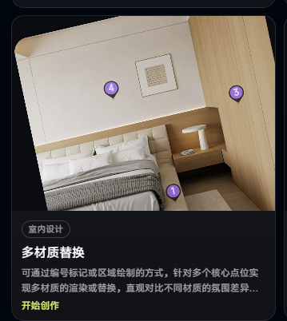

# 室内设计 AI 多材质替换技术实现分析

> 文档类型：产品与技术方案分析  
> 适用场景：室内设计效果图、实景照片、白模渲染图、3D 场景的多区域材质替换  
> 更新日期：2026-07-29



## 1. 功能概述

“多材质替换”是指用户在同一张室内设计图像或同一个三维空间中，通过编号标记、点击选择、框选、涂抹或自动识别等方式指定多个核心点位，并分别为这些区域选择不同材质，快速生成多套空间效果方案。

典型可替换区域包括：

- 墙面、背景墙和护墙板；
- 地板、地砖和地毯；
- 天花板和吊顶；
- 柜体、柜门、台面和饰面板；
- 沙发、床品、窗帘等软装；
- 金属、玻璃、木材、石材、涂料和墙布等表面。

这一能力主要解决以下问题：

- 降低设计师制作多套材质方案的时间成本；
- 让客户直观看到不同材质带来的空间氛围差异；
- 将抽象的材料样板转化为具象的空间效果；
- 提高选材沟通效率，缩短客户决策周期；
- 在方案早期快速探索不同风格和材质组合。

## 2. 核心结论

目前主流 AI 工具中的多材质替换，通常不是由单一模型完成，而是以下能力的组合：

1. **区域识别与分割**：将墙面、地面、柜体等目标转换为像素级蒙版。
2. **材质条件解析**：读取文字描述、材质参考图或 PBR 材质参数。
3. **空间结构约束**：提取深度、边缘、法线、平面和透视信息，避免空间结构发生明显变化。
4. **局部生成或材质投射**：只在指定区域内替换材质。
5. **光影与边缘融合**：修复材质边界、反射、阴影、遮挡和整体色调。
6. **多方案管理**：锁定相机、灯光和非编辑区域，生成可公平对比的材质组合。

如果输入只有一张二维图片，行业内最常见的是：

> AI 分割蒙版 + 材质参考图 + 深度/边缘约束 + 局部扩散生成 + 光影融合。

如果系统拥有原始 3D 模型，精度更高的方式是：

> 识别或选择模型表面 + 替换 PBR 材质槽 + 重新渲染 + AI 增强。

要求兼顾效率和准确度的产品，通常会采用二维 AI 与三维渲染相结合的混合路线。

## 3. 用户交互方式

### 3.1 编号标记

用户在墙面、柜门、地面等位置放置编号，例如 1、3、4。每个编号代表一个独立可编辑区域。

编号本身不参与图像生成，其作用是建立以下映射关系：

```text
区域编号 → 区域蒙版 → 区域语义 → 材质资源 → 生成参数
```

例如：

```text
区域 1 → 床体饰面蒙版 → 软包/木饰面 → 米白织物 → 哑光、低纹理强度
区域 3 → 柜门蒙版 → 木饰面 → 浅色白橡木 → 竖向纹理、真实尺寸
区域 4 → 墙面蒙版 → 墙漆/墙布 → 暖灰色涂料 → 低反射、细砂质感
```

编号标记一般有两种实现方式：

- **预分割选择**：系统先识别所有可编辑区域，用户点击编号时直接选中已有区域。
- **点提示分割**：用户点击一个点，系统将该点作为分割提示，实时计算完整区域。

后一种方式可使用类似 Segment Anything 的提示式分割模型。SAM 2 支持以点、框或蒙版作为输入，选择图像中的一个或多个对象。

### 3.2 区域绘制

用户使用画笔、套索或多边形工具直接绘制替换范围。系统将绘制结果转换为蒙版，并执行：

- 边界吸附；
- 孔洞填充；
- 边缘平滑；
- 小区域去噪；
- 前景遮挡排除；
- 蒙版膨胀、腐蚀和羽化。

区域绘制的优点是可控性高，适合墙面局部、柜门分区、异形背景墙等难以自动识别的区域；缺点是用户操作成本略高。

### 3.3 自动区域识别

系统可以在用户上传图片后，自动识别：

- 墙、地、顶；
- 门、窗、柜体；
- 床、沙发、桌椅；
- 台面、背景墙和软装；
- 可替换材质的连续表面。

自动识别通常由语义分割、实例分割、目标检测和深度估计共同完成。产品界面可以直接展示可点击的区域边界，减少用户手工绘制。

### 3.4 精修模式

为了满足设计师对边界的要求，产品通常还需要提供：

- 添加选区；
- 减少选区；
- 边缘硬度；
- 羽化范围；
- 遮挡保护；
- 撤销与重做；
- 蒙版显示和隐藏；
- 放大后的像素级修补。

## 4. 总体技术架构

```text
输入图片或 3D 场景
        │
        ▼
场景理解与预处理
  ├─ 语义/实例分割
  ├─ 深度估计
  ├─ 边缘与线稿提取
  ├─ 表面法线估计
  └─ 平面与透视分析
        │
        ▼
区域管理
  ├─ 编号与蒙版绑定
  ├─ 区域语义识别
  ├─ 前后景遮挡关系
  └─ 蒙版边界精修
        │
        ▼
材质条件处理
  ├─ 文本提示词
  ├─ 材质参考图编码
  ├─ 纹理无缝化
  ├─ 真实尺寸和铺贴参数
  └─ PBR 通道解析或生成
        │
        ▼
材质替换引擎
  ├─ 局部生成式重绘
  ├─ 透视纹理投射
  ├─ 3D/PBR 重新渲染
  └─ 混合替换
        │
        ▼
后处理与质量控制
  ├─ 光影协调
  ├─ 反射与阴影修复
  ├─ 边缘融合
  ├─ 色彩一致性
  └─ 结构变化检测
        │
        ▼
多方案对比与导出
```

## 5. 关键技术模块

### 5.1 图像预处理

输入图像首先需要完成标准化处理：

- 图像方向纠正；
- 色彩空间统一；
- 分辨率调整；
- 噪声和压缩伪影处理；
- 过曝、欠曝和白平衡修正；
- 主体区域检测；
- 原图特征缓存。

预处理的目的不是改变设计效果，而是为后续分割、深度估计和生成提供稳定输入。

### 5.2 区域分割与蒙版生成

区域分割是整个功能的基础。蒙版质量会直接影响材质边界、遮挡关系和最终可信度。

常见技术组合包括：

- 语义分割：判断像素属于墙面、地面、柜体还是家具；
- 实例分割：区分多个不同柜门、墙面或家具对象；
- 提示式分割：接收用户的点、框、涂抹或已有蒙版；
- 边缘检测：辅助识别柜门缝隙、墙角和家具轮廓；
- 深度分层：区分前景家具和后方墙面；
- 人工精修：处理玻璃、植物、灯具、毛发和镂空结构等复杂边界。

每个区域建议保存为独立的灰度蒙版，而不是直接写入原图：

```text
0   = 完全不修改
255 = 完全修改
1～254 = 边缘过渡区
```

### 5.3 区域语义识别

系统不仅需要知道“哪里要换”，还需要知道“这是什么表面”。

区域语义会影响：

- 推荐材质类型；
- 纹理尺度；
- 纹理方向；
- 光泽度范围；
- 是否允许使用金属或透明材质；
- 生成提示词；
- 透视投射策略。

例如，同一张木纹参考图用于地板、柜门和墙板时，应采用不同的尺度、铺贴方式和反射参数。

### 5.4 深度、法线与透视估计

二维图片没有显式三维信息，因此系统通常要估计：

- 单目深度图；
- 表面法线；
- 墙、地、顶的平面关系；
- 水平线和垂直线；
- 消失点；
- 相机视角；
- 前后景遮挡顺序。

这些信息用于：

- 让木纹、瓷砖缝和石材纹理符合空间透视；
- 区分竖直墙面和水平地面；
- 避免纹理像贴纸一样覆盖在图像上；
- 保持家具、墙线和柜体结构；
- 控制生成模型不要重画非目标区域。

ControlNet 一类条件控制技术可以将深度、边缘、语义分割和线稿等作为空间条件，引导扩散模型保持原图结构。

### 5.5 材质参考图处理

用户上传的材质图片可能来自样板照片、网页商品图、相机拍摄或材质图库。使用前通常需要：

- 裁剪有效材质区域；
- 去除文字、水印和边框；
- 校正拍摄透视；
- 去除不均匀照明；
- 修正白平衡；
- 生成无缝纹理；
- 分析纹理主方向；
- 估计真实重复尺寸；
- 提取视觉特征；
- 判断木材、石材、织物、金属或涂料等类别。

图像参考适配器可以把材质参考图编码为生成条件，使模型学习其颜色、纹理和视觉特征。IP-Adapter 是此类技术的代表之一。

### 5.6 PBR 材质

如果产品强调真实材料效果，不能只使用一张彩色贴图，还需要完整或近似的 PBR 材质数据。

常见通道包括：

- **Base Color**：基础颜色；
- **Roughness**：粗糙度，控制表面偏哑光还是偏光滑；
- **Metallic**：金属度；
- **Normal**：模拟凹凸细节对光线的影响；
- **Height/Displacement**：高度或几何位移；
- **Ambient Occlusion**：环境遮蔽；
- **Opacity**：透明度；
- **Specular**：高光反射；
- **Emissive**：自发光。

对于真实产品，还应记录：

- 材料实际宽高；
- 瓷砖和板材规格；
- 木纹方向；
- 拼缝宽度；
- 铺贴方式；
- 图案循环尺寸；
- 色号和产品 SKU；
- 表面工艺；
- 推荐使用场景。

### 5.7 局部生成式重绘

局部生成式重绘通常接收以下输入：

```text
原始图片
+ 区域蒙版
+ 区域材质参考图
+ 文本提示词
+ 深度/边缘/法线条件
+ 生成强度
+ 随机种子
```

模型只在蒙版范围内生成新的像素，并尽量保持非目标区域不变。

提示词一般包含：

- 区域语义；
- 材质类别；
- 颜色；
- 纹理方向；
- 表面光泽；
- 铺贴方式；
- 真实摄影或渲染风格；
- 保持原有结构的限制语句。

例如：

```text
将选中的整面柜门替换为浅色白橡木饰面，
保持柜门结构、缝隙、把手、相机视角和原始照明不变，
木纹竖向排列，比例真实，哑光表面，细腻自然。
```

局部生成的优势是能够自动处理部分光影、质感和细节；局限是模型可能改变柜缝、家具轮廓或材质尺度。

### 5.8 几何纹理投射

几何投射路线会先估计目标表面，再将材质纹理按照透视关系贴到区域中。

典型流程：

1. 识别平面四边形或曲面；
2. 计算单应性变换或近似 UV；
3. 根据真实尺寸确定纹理重复次数；
4. 调整纹理方向、偏移和旋转；
5. 利用原图亮度或法线恢复光影；
6. 通过 AI 修复边缘、遮挡和非平面区域。

这种方式特别适合：

- 地板；
- 瓷砖墙；
- 规则柜门；
- 大面积木饰面；
- 墙布和壁纸；
- 石材大板。

它比纯生成方式更容易控制纹理尺度和方向，但对几何分析的要求更高。

### 5.9 3D/PBR 重新渲染

如果系统拥有 SketchUp、3ds Max、Blender、Revit、C4D、USD 或其他三维场景，可以直接在模型层完成材质替换。

基本流程：

1. 选择模型对象或材质槽；
2. 将区域编号映射到模型表面；
3. 加载新的 PBR 材质；
4. 设置纹理尺寸、方向和 UV；
5. 保持相机、灯光和场景参数不变；
6. 使用实时、光栅或光线追踪渲染；
7. 必要时使用 AI 去噪、超分辨率或细节增强。

这一方式的优势包括：

- 纹理尺寸更准确；
- 反射和粗糙度更符合物理规律；
- 阴影和间接光照更合理；
- 可以切换视角；
- 可直接对应真实产品和施工规格；
- 多方案之间具备更强可比性。

主要成本在于：

- 必须有可用的三维场景；
- 模型对象和材质槽需要整理；
- UV 和灯光质量会影响结果；
- 渲染资源成本高于二维局部生成。

### 5.10 光影、反射与边缘融合

只在蒙版内部更换像素通常不够，因为材质变化可能影响区域外的视觉结果。

例如：

- 深色墙面会减少环境反射；
- 高光石材会映射附近家具；
- 金属表面会改变反射颜色；
- 粗糙度变化会改变高光范围；
- 玻璃和镜面会包含区域外内容；
- 新材质会影响墙角、踢脚线和接缝处的明暗。

因此产品通常需要：

- 蒙版边缘羽化；
- 扩展上下文生成范围；
- 光照重估；
- 阴影保留或重建；
- 反射区域二次处理；
- 色温和曝光协调；
- 边缘锐度匹配；
- 噪声、颗粒和渲染风格统一。

## 6. 多材质同时替换的实现方式

### 6.1 逐区域串行生成

系统依次处理每一个编号区域：

```text
原图
→ 替换区域 1
→ 替换区域 3
→ 替换区域 4
→ 整体融合
```

优点：

- 工程实现简单；
- 每个区域可以单独重试；
- 材质条件容易控制；
- 失败时只需重新生成局部区域。

缺点：

- 多次生成可能导致图像逐步漂移；
- 后处理区域可能破坏前一个区域；
- 不同区域的整体光影可能不一致；
- 总生成时间随区域数量增加。

### 6.2 多蒙版联合生成

系统一次提交多个区域及其材质条件：

```text
蒙版 1 + 材质 A
蒙版 3 + 材质 B
蒙版 4 + 材质 C
→ 联合生成
```

优点：

- 整体光影和风格更统一；
- 可以理解多个材质之间的关系；
- 减少多次编辑造成的累计误差。

缺点：

- 模型需要具备空间化多条件能力；
- 容易出现材质串区；
- 调试和训练难度较高；
- 一个区域失败可能导致整张方案重新生成。

### 6.3 分层合成与整体协调

较稳定的生产方案一般采用混合流程：

1. 每个区域保存独立蒙版和材质参数；
2. 对规则平面优先进行纹理投射；
3. 对不规则表面进行局部生成；
4. 将各区域结果分层合成；
5. 最后执行一次全局光影协调；
6. 通过结构检测确认非目标区域没有明显变化。

## 7. 三种技术路线对比

| 技术路线 | 主要输入 | 优点 | 局限 | 适用阶段 |
|---|---|---|---|---|
| 纯二维 AI 局部重绘 | 效果图、照片、蒙版、参考材质 | 快速、成本低、视觉自然 | 纹理尺寸和物理属性不一定准确，可能改变结构 | 概念方案、客户沟通 |
| 几何投射 + AI 融合 | 图片、蒙版、深度/平面、材质纹理 | 纹理方向和比例较可控，速度较快 | 复杂曲面、遮挡和反射处理困难 | 方案深化、快速选材 |
| 3D/PBR 重新渲染 | 三维模型、材质槽、PBR 材质、灯光 | 物理效果更准确，可多视角复用 | 场景准备和渲染成本较高 | 深化设计、产品选型、交付确认 |

## 8. 推荐的数据结构

每个可编辑区域可保存为一个区域对象：

```json
{
  "region_id": "3",
  "region_name": "右侧柜门",
  "semantic_class": "cabinet_door",
  "mask_url": "masks/region_3.png",
  "depth_layer": "midground",
  "surface_type": "vertical_plane",
  "material": {
    "material_id": "wood_oak_001",
    "sku": "optional-product-sku",
    "reference_image": "materials/oak_001.jpg",
    "pbr": {
      "base_color": "materials/oak_001_basecolor.jpg",
      "roughness": "materials/oak_001_roughness.jpg",
      "normal": "materials/oak_001_normal.jpg",
      "height": "materials/oak_001_height.jpg",
      "metallic": null
    },
    "physical_width_mm": 1200,
    "physical_height_mm": 1200,
    "rotation_deg": 90,
    "scale": 1.0,
    "roughness_adjustment": 0.1
  },
  "generation": {
    "prompt": "light white oak veneer, vertical grain, matte finish",
    "negative_prompt": "distorted cabinet, changed handles, warped edges",
    "strength": 0.55,
    "seed": 123456,
    "preserve_structure": true
  }
}
```

建议将蒙版、材质、生成参数和结果版本分开保存，便于：

- 单独修改一个区域；
- 回退到历史方案；
- 重复使用相同材质组合；
- 锁定随机种子进行公平对比；
- 记录客户最终选材结果；
- 对接商品和供应链系统。

## 9. 产品工作流建议

### 9.1 用户侧流程

1. 上传效果图、实景照片或打开已有项目。
2. 系统自动分析空间并标出可编辑区域。
3. 用户通过点击、编号、框选或涂抹确认区域。
4. 为每个区域选择材质：
   - 材质库；
   - 商品 SKU；
   - 上传参考图；
   - 文本描述；
   - 从其他案例提取。
5. 调整材质方向、尺寸、铺贴方式和光泽。
6. 锁定相机、构图、家具和照明。
7. 生成多套材质组合。
8. 使用并排、滑杆或局部放大方式对比。
9. 保存方案、导出图片或生成选材清单。

### 9.2 关键产品控制项

建议至少提供：

- 替换强度；
- 纹理尺度；
- 纹理方向；
- 材质旋转；
- 铺贴方式；
- 缝隙宽度；
- 光泽或粗糙度；
- 保留原始光影；
- 保留原始结构；
- 生成数量；
- 锁定随机种子；
- 单区域重新生成；
- 原图与方案对比。

## 10. MVP 实现建议

如果需要快速上线，可优先实现二维方案。

### 10.1 MVP 范围

- 支持上传一张效果图或照片；
- 支持点击分割和画笔选区；
- 支持 3～5 个独立区域；
- 支持材质图片上传；
- 支持区域名称和编号；
- 支持木材、石材、墙漆、瓷砖等常见类别；
- 支持纹理方向和生成强度；
- 使用深度、边缘或线稿保持结构；
- 逐区域局部生成；
- 最终进行整体色彩与边缘融合；
- 支持多方案保存和对比。

### 10.2 MVP 推荐流程

```text
上传图片
→ 自动分割候选区域
→ 用户点击或涂抹修正
→ 上传或选择材质
→ 识别材质类别和纹理方向
→ 提取深度与边缘
→ 局部生成式替换
→ 边缘和色彩融合
→ 输出对比方案
```

### 10.3 MVP 暂不承诺的能力

- 材质真实色差；
- 精确的物理反射；
- 施工级铺贴数量；
- 不同真实灯光环境下的绝对一致性；
- 复杂镜面和透明材质；
- 任意视角下结果一致；
- 由二维效果图恢复完全准确的三维结构。

产品文案中宜将这一阶段定位为“快速视觉预览”或“方案效果参考”，而不是“施工级真实渲染”。

## 11. 生产级升级路线

### 阶段一：二维视觉预览

- 点击/涂抹选区；
- 材质参考图；
- 局部生成；
- 多方案对比。

目标：快速验证用户需求和使用频率。

### 阶段二：结构和纹理增强

- 增加深度与法线估计；
- 平面和消失点检测；
- 纹理无缝化；
- 真实尺寸与铺贴方向；
- 几何投射与 AI 融合；
- 结构变化自动检测。

目标：提升墙面、地面和柜体等规则表面的准确度。

### 阶段三：真实材质库

- 建立带物理尺寸的材质库；
- 接入 PBR 通道；
- 绑定产品 SKU；
- 支持色号、规格和供应商信息；
- 生成选材清单和报价接口。

目标：从视觉方案工具升级为选材与交易工具。

### 阶段四：3D 场景融合

- 对接设计软件或三维场景；
- 自动识别材质槽；
- 将二维编号映射到三维表面；
- PBR 实时或离线渲染；
- 支持多视角一致性；
- AI 负责材质推荐、纹理生成、去噪和增强。

目标：提高物理真实性并服务深化设计和交付。

## 12. 质量评估指标

### 12.1 区域准确度

- 蒙版与真实区域的交并比；
- 边缘偏移像素；
- 是否误选前景家具；
- 是否漏选细小区域；
- 用户平均修正次数。

### 12.2 结构保持度

- 非目标区域像素变化率；
- 柜门缝、墙线和家具轮廓偏移；
- 深度与边缘条件一致性；
- 原图和结果之间的特征相似度；
- 用户是否发现“家具被重画”。

### 12.3 材质还原度

- 颜色接近程度；
- 纹理方向正确率；
- 纹理尺度合理性；
- 图案循环和拼缝准确度；
- 粗糙度、金属度和反射观感；
- 材质参考图与结果区域的特征相似度。

### 12.4 整体自然度

- 光照方向是否一致；
- 明暗层次是否合理；
- 边缘是否存在贴图感；
- 遮挡关系是否正确；
- 噪声和锐度是否统一；
- 多区域之间是否存在材质串色。

### 12.5 产品效率

- 首次生成耗时；
- 单区域重试耗时；
- 平均生成次数；
- 用户完成一套方案所需时间；
- 多方案对比后的选材确认率；
- 客户决策周期变化。

## 13. 常见问题与风险

### 13.1 结构被模型改变

表现：

- 柜门数量变化；
- 把手消失；
- 墙线弯曲；
- 家具轮廓改变；
- 装饰物被重新生成。

应对方式：

- 降低生成强度；
- 加强深度、边缘和线稿条件；
- 锁定非目标区域；
- 采用纹理投射而不是完全生成；
- 对输出执行结构差异检测。

### 13.2 材质比例不真实

表现：

- 木纹过大或过小；
- 瓷砖规格失真；
- 石材纹理像壁纸；
- 拼缝不符合实际产品。

应对方式：

- 保存材质物理尺寸；
- 识别目标平面；
- 根据透视和深度计算重复次数；
- 提供尺度和铺贴方向控制；
- 对规则表面使用几何投射。

### 13.3 材质边缘泄漏

表现：

- 墙面材质覆盖灯具、床头或装饰画；
- 柜体纹理进入墙面；
- 地面纹理覆盖地毯和家具。

应对方式：

- 增加前景实例分割；
- 建立遮挡层级；
- 使用负点提示修正蒙版；
- 对边缘区域二次生成；
- 支持用户精修。

### 13.4 光影不一致

表现：

- 新材质亮度与空间不一致；
- 镜面或石材没有正确反射；
- 材质看起来像平面贴纸；
- 多个区域的色温不同。

应对方式：

- 分离原图亮度与色彩；
- 估计光照和法线；
- 保留原始阴影；
- 对高反射材质扩大生成上下文；
- 最后进行全局色彩协调。

### 13.5 多次生成造成漂移

应对方式：

- 保存原始图像并始终从原图计算；
- 各区域以图层形式合成；
- 锁定随机种子；
- 减少连续编码和解码；
- 最后只执行一次全局融合。

### 13.6 视觉效果与真实材料存在差异

二维 AI 结果受显示器、原图灯光、白平衡和模型推断影响，不能完全代表真实材料。

产品应明确区分：

- 概念效果；
- 视觉参考；
- 产品近似预览；
- 基于真实 PBR 与灯光的物理渲染；
- 实物确认。

最终选材仍应结合实物样板、产品色号和现场光照。

## 14. 成本与性能优化

可采用以下方式降低服务成本和等待时间：

- 上传时预计算分割、深度和边缘；
- 缓存区域蒙版和材质特征；
- 低分辨率快速预览，高分辨率最终输出；
- 只重新生成被修改的区域；
- 对规则表面使用计算成本较低的纹理投射；
- 多个区域并行处理；
- 对失败区域局部重试；
- 缓存相同材质和相同区域的生成条件；
- 对常用材质建立预计算特征库。

## 15. 最终建议

如果产品目标是帮助设计师快速向客户展示不同材质组合，建议优先采用：

> 提示式分割 + 独立区域蒙版 + 材质参考图 + 深度/边缘约束 + 局部生成 + 全局融合。

这一方案开发周期较短，适用于已有室内效果图和实景照片，也容易实现编号标记、区域绘制和多方案对比。

如果产品进一步强调“精准选材”和“真实产品落地”，应逐步增加：

- 真实产品 SKU；
- 物理尺寸；
- 无缝纹理；
- PBR 通道；
- 铺贴规则；
- 三维模型和材质槽；
- 固定灯光与相机；
- 物理渲染；
- 材料清单和供应链接口。

因此，一个合理的产品定位是：

```text
二维 AI：提高创意探索和客户决策效率
几何投射：提高纹理尺度和空间透视准确度
三维 PBR：提高真实材料与最终交付的一致性
```

三者不是互相替代，而是分别服务于概念设计、方案深化和真实交付。

## 16. 参考资料

1. Meta AI, **Segment Anything Model 2**  
   <https://ai.meta.com/research/sam2/>

2. Lvmin Zhang, Anyi Rao, Maneesh Agrawala, **Adding Conditional Control to Text-to-Image Diffusion Models (ControlNet)**  
   <https://arxiv.org/abs/2302.05543>

3. Hu Ye et al., **IP-Adapter: Text Compatible Image Prompt Adapter for Text-to-Image Diffusion Models**  
   <https://arxiv.org/abs/2308.06721>

4. Adobe, **Use Generative Fill in Adobe Firefly**  
   <https://helpx.adobe.com/firefly/web/work-with-images/edit-images/generative-fill.html>

5. Adobe, **Materials in Substance 3D Stager**  
   <https://helpx.adobe.com/substance-3d-stager/desktop/objects/materials.html>

6. Adobe, **Material Projections in Substance 3D Stager**  
   <https://helpx.adobe.com/substance-3d-stager/desktop/features/material-projections.html>

