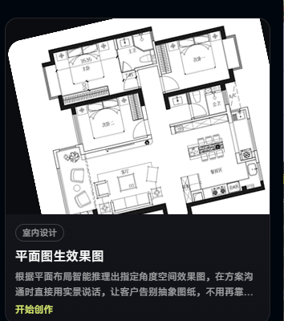
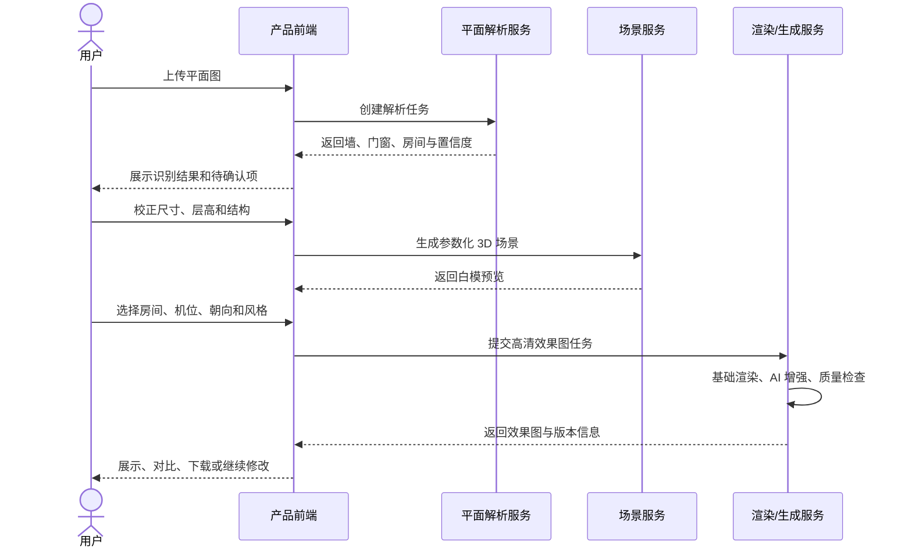

# 平面图生效果图：产品与技术实施方案

> 版本：V1.0  
> 编写日期：2026-07-29  
> 文档状态：产品评审 / 技术立项建议稿  
> 参考功能图：`平面生效果图.png`



---

## 1. 执行摘要

“平面图生效果图”的目标，是把二维户型布局转换为指定视角下的写实室内空间图，用于方案沟通、风格探索和客户决策。

如果产品需要真正兑现“按平面布局”“指定角度”“后续可换角度”，推荐采用以下混合路线：

```text
平面图识别与矢量化
→ 参数化 3D 空间
→ 明确的三维相机
→ 基础渲染和结构控制图
→ 生成式 AI 写实增强
→ 结构一致性检查
```

不建议把整张俯视平面图直接交给图像生成模型，让模型通过一句“从入口看客厅”猜测透视效果。这种方式适合快速灵感图，但无法稳定保证墙体、门窗、尺度、相机角度和多视图一致性。

本方案的核心原则是：

1. **结构化 3D 场景是唯一空间真值。**
2. **相机角度必须是可计算的真实相机位姿，而不是提示词。**
3. **生成式 AI 负责材质、灯光、软装细节和写实感，不负责决定建筑几何。**
4. **AI 自动识别后必须允许用户低成本纠错。**
5. **AI 效果图应定位为设计意向表达；施工级准确性仍依赖完整尺寸与专业校核。**

---

## 2. 产品定义

### 2.1 用户问题

传统平面图需要客户自行把俯视线稿转换为空间想象，沟通成本高，常见问题包括：

- 客户无法理解空间开间、进深和通透关系。
- 客户难以判断从入口、沙发、餐厅等位置看到的真实画面。
- 设计师需要反复用语言解释墙面、门窗和家具之间的关系。
- 每次调整方案都重新建模和渲染，周期较长。

### 2.2 目标用户

- 室内设计师与设计工作室
- 家装顾问与销售人员
- 房地产、样板间和租售展示团队
- 家具、定制柜和软装品牌
- 需要快速判断空间效果的普通业主

### 2.3 核心输入

- 平面图图片：JPG、PNG
- 图纸文档：PDF
- 矢量/CAD：DWG、DXF、SVG
- 可选补充信息：
  - 一段已知尺寸或完整尺寸标注
  - 层高、门高、窗台高
  - 房间类型
  - 风格、色彩和材质偏好
  - 家具清单或商品 SKU
  - 参考效果图

### 2.4 核心输出

- 指定房间、指定相机位置与朝向的效果图
- 可选的多方案、多风格版本
- 可选的同一空间多视角图片
- 可编辑 3D 场景或白模预览
- 相机、风格、材质和生成参数的可复现记录

### 2.5 建议的产品承诺

建议文案：

> 自动理解平面布局，生成指定机位的空间设计意向效果图，帮助客户快速感受空间关系与设计氛围。

不建议在缺少完整尺寸、立面和材料信息时承诺：

- “100% 还原真实空间”
- “施工级精准”
- “平面图中没有的信息也能准确恢复”

---

## 3. 平面图能够提供与不能提供的信息

二维平面图只能表达部分三维信息。系统必须区分“读取到的事实”“规则推断结果”和“用户设定”。

| 信息类型 | 通常能否从平面图获得 | 建议处理 |
|---|---:|---|
| 墙体位置、房间轮廓 | 能 | 模型识别后进行拓扑修复 |
| 门窗平面位置 | 通常能 | 检测符号并约束到墙体 |
| 房间名称 | 通常能 | OCR 与房间区域关联 |
| 平面尺寸、比例 | 部分能 | OCR 尺寸；失败时用户标定一段长度 |
| 家具占地和朝向 | 部分能 | 识别基础图例，复杂家具允许忽略或替换 |
| 层高 | 通常不能 | 使用项目默认值并要求确认 |
| 门高、窗高、窗台高 | 通常不能 | 使用类型模板或用户补充 |
| 吊顶、灯带、立面造型 | 不能 | 由风格模板、立面输入或用户编辑决定 |
| 材质、颜色、品牌型号 | 不能 | 由风格配置、参考图或真实商品库决定 |
| 光照时间、太阳方向 | 不能 | 由用户选择或渲染模板决定 |
| 隐藏空间的真实外观 | 不能 | 只能基于规则和设计先验生成 |

建议在数据结构中为推断字段保存来源：

```json
{
  "ceilingHeight": {
    "value": 2.8,
    "unit": "m",
    "source": "system_default",
    "confirmedByUser": false
  }
}
```

---

## 4. 行业常见实现路线

### 4.1 路线对比

| 路线 | 典型流程 | 视角准确性 | 多视角一致性 | 可编辑性 | 适用场景 |
|---|---|---:|---:|---:|---|
| 纯图生图 | 平面图 + 提示词直接生成 | 低 | 低 | 低 | 灵感图、营销图、快速验证 |
| 结构条件图像生成 | 平面图/边缘/深度 + 条件扩散 | 中低 | 低至中 | 低 | 已有目标透视底图的写实化 |
| 参数化 3D + 传统渲染 | 识图 → 3D → 相机 → PBR/光追 | 高 | 高 | 高 | 准确空间表达、可漫游设计 |
| 参数化 3D + 生成式增强 | 3D → 控制图 → AI 写实 | 高 | 中高至高 | 高 | 推荐的商业产品路线 |
| 多视图生成 + 3D 重建 | 平面条件 → 多视 RGB-D → NeRF/3DGS/网格 | 中高 | 中高 | 中低 | 前沿研发、可漫游生成场景 |

### 4.2 纯图生图

流程通常是：

```text
平面图 + 房间类型 + 风格 + 视角文字描述
→ 多模态模型或图像生成模型
→ 一张写实图片
```

优点：

- 接入快，适合快速演示。
- 不需要完整 3D 资产库。
- 单张图片的视觉冲击力可以很强。

局限：

- 俯视图与人眼透视图不是像素对齐关系。
- “从东南角看电视墙”只是语义提示，不是真实相机。
- 容易改变门窗数量、墙体位置、家具朝向和尺度。
- 同一房间换一个角度后，家具、材质和立面可能发生变化。
- 不能可靠用于量尺、报价或施工判断。

因此它适合“创意模式”，不适合承担“布局锁定模式”。

### 4.3 参数化 3D

流程通常是：

```text
平面图
→ 墙、门、窗、房间、尺寸识别
→ 矢量拓扑
→ 墙体拉伸和门窗开洞
→ 家具与材质资产
→ 三维相机
→ 实时渲染或离线光追
```

其优势是相机、尺度和多角度一致性可控，也能支持后续编辑、商品绑定、清单和漫游。

从公开产品能力看，成熟商业平台普遍把“平面图识别”输出为可编辑 3D 项目，而不是只返回一张图片：

- [Planner 5D 官方 API](https://tool.planner5d.com/api)明确描述识别墙体、洞口和房间边界，并返回可编辑、可交互的 3D 项目。
- [Coohom AIHom 官方说明](https://open.coohom.com/case/ai-home-design)描述了识别墙、房间、门窗后生成可编辑、可漫游 3D 场景的流程。

厂商不会公开全部内部实现，但“可编辑、可漫游、可切换相机”的输出形态，意味着系统内部必然保存了显式空间结构。

### 4.4 参数化 3D + 生成式 AI

这是本方案推荐的路线：

- 3D 引擎保证几何、尺度、遮挡和透视。
- 生成模型补充写实材质、氛围、软装细节和自然光感。
- 深度图、法线图、语义图、边缘图和对象掩码用于约束生成。
- 不合格区域可按对象掩码局部重绘，不必整图重做。

[ControlNet](https://arxiv.org/abs/2302.05543)证明了深度、边缘、分割等空间条件可以控制扩散模型。但这种控制仍不等于工程几何约束，因此控制图应来自目标相机下的 3D 投影，而不是直接使用俯视平面图。

### 4.5 前沿的多视图生成路线

[HouseCrafter（ICCV 2025）](https://openaccess.thecvf.com/content/ICCV2025/html/Chen_HouseCrafter_Lifting_Floorplans_to_3D_Scenes_with_2D_Diffusion_Models_ICCV_2025_paper.html)展示了从平面图条件生成多视角 RGB-D 图像，再重建完整室内 3D 场景的研究路线。

该路线很有潜力，但当前更适合作为二期研发方向：

- 模型与训练数据要求高。
- 全屋多视图生成延迟较高。
- 生成场景不一定具备 CAD 级可编辑性。
- 商用落地还需要审查模型、训练数据和资产许可。

NeRF 和 3D Gaussian Splatting 更适合“已经拥有多张同一空间图片”的新视角重建。只有一张平面图时，它们不能独立解决材质与外观信息缺失问题。

---

## 5. 推荐的端到端系统架构

```mermaid
flowchart LR
    A["平面图输入<br/>PNG / PDF / DWG"] --> B["预处理与质量评分"]
    B --> C["墙体、门窗、房间、文字识别"]
    C --> D["矢量化与拓扑修复"]
    D --> E["用户确认尺寸与纠错"]
    E --> F["BIM-lite 场景数据"]
    F --> G["参数化 3D 建模"]
    G --> H["家具布局与资产检索"]
    H --> I["相机选择与机位推荐"]
    I --> J["基础 RGB / Depth / Normal / Semantic"]
    J --> K["受控生成式写实增强"]
    K --> L["结构一致性与画质检查"]
    L --> M["预览图 / 高清图 / 多角度输出"]
```



### 5.1 输入处理

#### 矢量输入优先

如果平面图来自自身编辑器、CAD、BIM 或结构化业务系统，应直接读取墙体、房间、门窗和尺寸数据，跳过图片识别。

输入优先级建议：

```text
内部结构化数据 > DWG/DXF/SVG > 矢量 PDF > 高清栅格图 > 拍照图纸
```

不要把本来已经结构化的数据先截图，再让 AI 重新识别。

#### 栅格图预处理

- 自动旋转与方向校正
- 裁剪图框、标题栏和无关留白
- 透视矫正
- 去噪与对比度增强
- 图纸区域检测
- 多楼层、多图框拆分
- 输入清晰度和可识别性评分
- 判断是否为平面图而不是立面图、效果图或手绘透视图

#### 尺度恢复

优先顺序：

1. 读取 DWG/DXF 中的真实坐标。
2. OCR 识别尺寸标注并关联尺寸线。
3. 读取已知标准构件尺寸作为弱参考。
4. 要求用户在图中标记一段已知长度。
5. 若仍无法获得比例，只允许生成“非量尺意向图”。

### 5.2 平面图识别与矢量化

需要识别的元素包括：

- 外墙、内墙、墙厚和墙体中心线
- 房间轮廓、房间类型和相邻关系
- 门、窗、开口、推拉门及其朝向
- 柱、烟道、楼梯、阳台
- 家具图例和主要设备
- 房间名称、尺寸、面积、标高

推荐“模型 + 规则”组合：

- 语义分割：墙体、房间、背景
- 目标检测：门窗、家具、洁具和符号
- OCR：房间名称、尺寸、面积
- 几何算法：直线、圆弧、墙厚、交点与闭合多边形
- 拓扑规则：门窗必须依附于墙体、房间不可非法重叠

[Residential Floor Plan Recognition and Reconstruction（CVPR 2021）](https://openaccess.thecvf.com/content/CVPR2021/html/Lv_Residential_Floor_Plan_Recognition_and_Reconstruction_CVPR_2021_paper.html)给出了“识别结构元素、文字、比例并进行矢量化和 3D 重建”的完整公开研究参考。

### 5.3 BIM-lite 数据结构

建议使用独立于具体渲染引擎的中间格式：

```json
{
  "projectId": "proj_123",
  "unit": "m",
  "scaleSource": "ocr_dimension",
  "levels": [
    {
      "id": "level_1",
      "elevation": 0,
      "ceilingHeight": 2.8,
      "rooms": [
        {
          "id": "room_living",
          "type": "living_room",
          "polygon": [[0, 0], [4.2, 0], [4.2, 5.6], [0, 5.6]],
          "confidence": 0.96
        }
      ],
      "walls": [
        {
          "id": "wall_01",
          "start": [0, 0],
          "end": [4.2, 0],
          "thickness": 0.2,
          "height": 2.8,
          "source": "ai_detected"
        }
      ],
      "openings": [
        {
          "id": "window_01",
          "type": "window",
          "wallId": "wall_01",
          "offset": 1.1,
          "width": 1.8,
          "height": 1.5,
          "sillHeight": 0.9,
          "heightSource": "system_default"
        }
      ]
    }
  ]
}
```

数据模型需要保存：

- 原始图坐标与真实世界坐标映射
- 每个元素的识别置信度
- 字段来源：图纸、AI、默认值、用户修改
- 修改历史与版本
- 资产 ID、材质 ID 和真实商品 SKU
- 相机和生成参数

### 5.4 拓扑修复与人工纠错

自动检查：

- 墙体是否闭合
- 墙体交点是否吸附
- 房间是否重叠或存在无法解释的缝隙
- 门窗是否落在墙体上
- 门洞是否连接有效房间
- 尺寸链是否互相矛盾
- 家具是否越过房间边界

低置信度结果应在平面图上高亮，并允许用户：

- 拖动墙线和角点
- 调整墙厚
- 补画或删除门窗
- 修改房间名称
- 输入准确尺寸
- 确认层高和门窗高度

对于商业产品，“自动识别 + 快速确认”通常比追求完全无人干预更可靠。

### 5.5 参数化 3D 建模

根据 BIM-lite 数据程序化生成：

- 墙体拉伸
- 门窗布尔开洞
- 地面、天花、踢脚线
- 柱、梁、烟道和基础楼梯
- 默认门窗模型
- 家具占位体和真实资产
- 太阳光、环境光和室内基础照明

建议使用可稳定导出的场景格式：

- glTF/GLB：适合网页预览和轻量传输
- USD/USDZ：适合复杂场景和后续管线
- 引擎内部场景格式：用于渲染任务

建议默认参数仅作为可编辑模板，不应包装为 AI 识别事实：

| 参数 | 建议初始默认值 | 说明 |
|---|---:|---|
| 住宅层高 | 2.8 m | 用户必须可修改 |
| 室内门高 | 2.1 m | 按项目标准覆盖 |
| 窗台高 | 0.9 m | 落地窗等类型需单独处理 |
| 站立视角眼高 | 1.6 m | 可提供坐姿、儿童视角 |
| 室内常用等效焦距 | 20–28 mm | 防止过度广角畸变 |

### 5.6 家具布局与资产检索

首版建议优先使用：

- 房间类型模板
- 规则与约束求解
- 真实 3D 资产检索
- 家具占地框和安全通道检查
- 用户已有家具图例的映射

规则示例：

- 沙发朝向电视墙或主要焦点墙。
- 餐桌靠近厨房或餐边空间。
- 床头优先靠实墙并避开主要门洞。
- 柜门、房门和主要通道不能被家具阻挡。
- 家具尺寸必须与空间尺度匹配。

研究模型如 [ATISS](https://research.nvidia.com/publication/2021-12_atiss-autoregressive-transformers-indoor-scene-synthesis)可以根据房间类型和平面轮廓生成家具集合、位置、尺寸和朝向，但公开实现及其训练数据不一定满足商业许可要求。MVP 更适合把研究方法作为架构参考，使用自有规则、授权数据和资产库。

如果业务需要购买闭环，应让效果图中的关键家具绑定：

- 真实 SKU
- 实际尺寸
- 可选材质
- 价格与库存
- 对应 3D 模型

不要让模型自由生成一个无法购买、无法生产的“虚构商品”，再把它当成可落地方案。

### 5.7 相机与指定角度

“指定角度”应设计为明确的交互：

1. 用户选择目标房间。
2. 在平面图内放置相机点。
3. 拖动朝向箭头。
4. 选择站立、坐姿或自定义眼高。
5. 选择标准、广角或特写镜头。
6. 查看低成本白模预览。
7. 确认后生成高清效果图。

系统需要检查：

- 相机是否落在墙体或家具内部
- 相机与墙面距离是否过近
- 视锥是否覆盖目标房间
- 是否存在严重遮挡
- 画面垂直线是否需要保持垂直
- 焦距是否造成不合理空间夸张

可以自动生成若干候选机位并评分：

```text
机位得分 =
目标空间覆盖率
+ 主焦点可见度
+ 门窗与主要立面信息量
- 遮挡率
- 极端广角惩罚
- 穿墙或碰撞惩罚
```

推荐机位示例：

- 从入口看客厅
- 从客厅看餐厨
- 正对电视墙
- 沙发坐姿视角
- 房间对角线广角

### 5.8 两阶段渲染

#### 阶段一：快速预览

目标是让用户先确认几何和视角：

- 低模或白模
- 简单材质
- 实时 WebGL 或快速离线渲染
- 低分辨率输出
- 同时生成深度、法线、语义和对象 ID

#### 阶段二：高清效果图

输入包括：

- 基础 RGB 渲染
- 深度图
- 法线图
- 边缘图
- 语义分割图
- 对象实例掩码
- 风格参考图
- 结构化材质和灯光配置

生成策略：

- 使用较低重绘强度，减少几何漂移。
- 墙、门窗、固定柜体使用更强结构约束。
- 软装、植物和装饰品允许更高生成自由度。
- 对门窗、镜面、灯具等高风险区域进行局部重绘。
- 最后再进行超分辨率和细节增强。

建议提供两种产品模式：

| 模式 | 几何约束 | AI 自由度 | 使用场景 |
|---|---:|---:|---|
| 布局锁定 | 高 | 低至中 | 客户方案沟通、设计确认 |
| 创意探索 | 中低 | 高 | 风格灵感、营销展示 |

### 5.9 生成质量检查

结构检查：

- 墙角是否弯曲、断裂或增加
- 门窗数量和位置是否一致
- 主要家具占地是否偏移
- 生成图深度与基础 3D 深度是否一致
- 语义分割轮廓与基础控制图是否一致
- 镜面是否生成错误空间
- 家具是否穿墙、悬空或碰撞

画质检查：

- 清晰度
- 曝光和白平衡
- 透视合理性
- 材质重复与纹理拉伸
- 灯具、玻璃、手柄等细节畸变
- 水印、文字和异常伪影

不合格处理：

- 局部问题：按对象掩码重绘。
- 风格问题：调整风格条件或参考图。
- 几何问题：降低 AI 重绘强度或回退到确定性渲染。
- 严重偏离：拒绝当前结果并自动重试，不向用户展示。

同一项目的多角度必须共用同一组：

- 3D 几何
- 家具资产 ID
- 材质 ID
- 灯光配置
- 场景版本

只固定随机种子不能保证多视角一致。

---

## 6. 用户体验流程



### 6.1 建议页面步骤

#### 第一步：上传

- 支持拖拽上传。
- 显示输入质量评分。
- 提示“清晰扫描图、单楼层、带尺寸”的成功率更高。

#### 第二步：识别确认

- 不要只显示加载动画后直接出图。
- 在原平面图上覆盖识别墙线、门窗和房间。
- 用颜色标注低置信度区域。
- 用户完成最少确认后才能进入下一步。

#### 第三步：空间预览

- 展示 2D/3D 联动。
- 用户在 2D 中拖动相机，3D 预览实时更新。
- 支持系统推荐机位。

#### 第四步：设计条件

- 房间类型
- 风格预设
- 色彩偏好
- 材质偏好
- 家具保留/替换
- 白天/夜晚
- 布局锁定/创意探索

#### 第五步：生成与比较

- 先返回低清样张，再按需生成高清。
- 支持 2–4 个方案并排比较。
- 显示所用场景版本、相机和风格。
- 支持“保持空间，只换风格”和“保持风格，只换机位”。

### 6.2 失败与降级体验

| 问题 | 产品处理 |
|---|---|
| 图纸模糊 | 提示重传或进入手动描墙模式 |
| 没有尺寸 | 要求标记一段已知长度 |
| 门窗识别不确定 | 高亮并要求用户确认 |
| 曲墙、复式暂不支持 | 明确告知范围，允许转人工或简化处理 |
| AI 图偏离结构 | 自动回退到基础渲染或重新生成 |
| GPU 队列繁忙 | 先返回白模和预计任务状态，不阻塞编辑 |

---

## 7. 建议的系统组件

| 组件 | 职责 | 可选技术 |
|---|---|---|
| Web 前端 | 上传、纠错、2D/3D 联动、机位选择 | React/Vue + Canvas/SVG + Three.js |
| API 网关 | 鉴权、项目和任务接口 | FastAPI、NestJS、Go |
| 图纸预处理 | PDF 页面拆分、矫正、去噪、OCR | OpenCV、Poppler、OCR 服务 |
| 平面解析服务 | 墙、门窗、房间和符号识别 | PyTorch/ONNX/TensorRT |
| 几何与拓扑服务 | 矢量化、闭合、尺度和规则校验 | Shapely/GEOS、自研几何模块 |
| 场景服务 | BIM-lite、版本、3D 场景生成 | 自研 + glTF/USD |
| Web 预览 | 低模渲染和相机交互 | Three.js/WebGPU |
| 离线渲染 | RGB、Depth、Normal、Semantic | Blender、Unreal 或现有云渲染引擎 |
| AI 生成服务 | 结构约束写实增强、局部重绘 | 支持深度/边缘/分割条件的商用模型或 API |
| 任务队列 | 异步解析、渲染和重试 | Temporal、Celery、Redis Queue、Kafka |
| 数据库 | 项目、场景版本、任务与指标 | PostgreSQL |
| 对象存储 | 原图、控制图、模型和结果 | S3 兼容对象存储 |
| 监控 | 延迟、失败率、GPU 利用率和质量 | OpenTelemetry、Prometheus、Grafana |

技术选择原则：

- 如果已有 2D/3D 设计引擎，优先复用其结构数据和渲染能力。
- 如果从零做 MVP，Three.js + Blender 服务端是相对务实的组合。
- 不要在首版同时自研完整 CAD、完整渲染器和大型生成模型。
- 生成模型应封装为可替换适配层，避免绑定单一供应商。

---

## 8. API 与任务状态建议

### 8.1 主要接口

```http
POST   /v1/floorplans
GET    /v1/floorplans/{floorplanId}
PATCH  /v1/floorplans/{floorplanId}/elements
POST   /v1/floorplans/{floorplanId}/confirm

POST   /v1/scenes
GET    /v1/scenes/{sceneId}
POST   /v1/scenes/{sceneId}/camera-recommendations
POST   /v1/scenes/{sceneId}/preview

POST   /v1/renders
GET    /v1/renders/{renderId}
POST   /v1/renders/{renderId}/cancel
POST   /v1/renders/{renderId}/retry
POST   /v1/renders/{renderId}/variations
GET    /v1/jobs/{jobId}/events
```

### 8.2 渲染任务示例

```json
{
  "sceneId": "scene_123",
  "sceneVersion": 7,
  "camera": {
    "position": [2.4, 1.6, 3.8],
    "target": [4.6, 1.4, 2.1],
    "verticalFov": 68
  },
  "mode": "layout_locked",
  "style": {
    "preset": "modern_warm",
    "referenceImageIds": ["img_ref_02"]
  },
  "lighting": {
    "preset": "daylight_soft",
    "time": "15:00"
  },
  "output": {
    "width": 1536,
    "height": 1024,
    "count": 2
  }
}
```

### 8.3 异步状态机

```text
UPLOADED
→ PREPROCESSING
→ PARSING
→ NEEDS_CONFIRMATION
→ SCENE_BUILDING
→ PREVIEW_READY
→ RENDER_QUEUED
→ BASE_RENDERING
→ AI_REFINING
→ QUALITY_CHECKING
→ COMPLETED
```

失败状态应包含：

- `INPUT_REJECTED`
- `PARSING_FAILED`
- `SCENE_INVALID`
- `RENDER_FAILED`
- `GENERATION_FAILED`
- `QUALITY_REJECTED`

所有任务需要具备：

- 幂等键
- 可重试策略
- 超时与取消
- 场景版本锁定
- 供应商调用记录
- 失败原因和用户可读提示

进度通知可按部署场景选择：

- 前端实时进度：SSE 或 WebSocket
- 简单客户端：轮询任务接口
- 企业系统集成：签名 Webhook

任务响应建议至少包含：

```json
{
  "jobId": "job_123",
  "status": "AI_REFINING",
  "progress": 72,
  "retryable": true,
  "sceneId": "scene_123",
  "sceneVersion": 7,
  "estimatedRemainingSeconds": 18,
  "error": null
}
```

当用户修改场景时：

- 已完成结果继续保留并标记其对应的旧场景版本。
- 尚未开始的旧版本任务可自动取消。
- 正在执行的旧版本任务可根据成本策略取消或完成后归档。
- 新任务必须显式绑定新的 `sceneVersion`，防止结果错配。
- 重复提交相同版本、相机和生成参数时，使用幂等键返回已有任务或缓存结果。

---

## 9. 模型、数据与商用许可

### 9.1 平面图识别

[CubiCasa5K 官方仓库](https://github.com/CubiCasa/CubiCasa5k)是常见的平面图解析基线，覆盖房间、墙体和多类图纸对象。但其仓库和数据许可包含非商业限制，适合研究和原型验证，不应未经许可直接用于商业生产。

[Raster2Seq 官方仓库](https://github.com/Cornell-VAILab/Raster2Seq)采用序列方式输出带语义的房间多边形，可作为更现代的架构参考。即使代码采用宽松许可，也仍需分别审查预训练权重所使用数据集的许可。

生产建议：

- 使用自有或明确授权的户型图训练。
- 建设适合中文图纸、国内符号和尺寸标注的数据集。
- 把公开模型作为基线，不把来源不明的权重直接上线。

### 9.2 家具布局

ATISS 等研究模型证明了“根据房间类型和平面轮廓生成家具类别、位置、尺寸和朝向”的可行性，但公开实现与 3D 资产数据经常带有非商业或用途限制。

生产建议：

- 首版采用规则、模板和资产检索。
- 二期用自有设计案例训练布局模型。
- 把碰撞、可达性和空间边界作为硬约束。

### 9.3 图像生成

ControlNet 代码本身的许可，不代表任意基础模型、微调权重和训练数据都可商用。每一个依赖都应单独检查：

- 基础模型许可
- ControlNet/Adapter 权重许可
- LoRA 和风格模型许可
- 参考图版权
- 输出使用条款
- API 供应商的数据保留政策

建议建立模型资产清单：

| 字段 | 说明 |
|---|---|
| 模型/权重名称 | 精确到版本 |
| 来源地址 | 官方仓库或供应商 |
| 许可证 | 代码、权重、数据分别记录 |
| 商用允许 | 是/否/需授权 |
| 输出归属 | 供应商条款 |
| 数据是否留存 | 是否用于训练或审查 |
| 上线审批人 | 法务/安全/技术负责人 |

### 9.4 3D 资产与材质

需要审查：

- 模型是否允许商业展示与再分发
- 材质贴图的版权
- 品牌商品的授权范围
- 用户上传模型的权属
- 导出场景时是否会分发受限资产

---

## 10. 数据策略

### 10.1 训练与评测数据

需要覆盖：

- 不同图纸风格和线宽
- 中文、英文和混合标注
- 低清扫描、截图、压缩图
- 直墙、斜墙、曲墙
- 不同门窗符号
- 有家具与无家具平面图
- 单间、小户型、大平层和多房户型
- 常见错误输入

标注建议包括：

- 墙体中心线、厚度和类型
- 房间多边形和类别
- 门窗位置、宽度、类型和朝向
- 柱、烟道、楼梯和阳台
- 家具框、类别和朝向
- 尺寸文字、尺寸线与对应对象
- 图纸到真实坐标的比例

### 10.2 用户数据闭环

在获得明确授权后，可记录：

- AI 初始识别结果
- 用户纠正后的结构
- 识别失败类型
- 用户选择的机位
- 用户保留和删除的生成结果
- 结构一致性评分
- 用户主观评分

不能默认把客户户型图用于训练。应提供：

- 明确的数据使用说明
- 项目删除能力
- 企业客户的数据隔离
- 可配置的数据保留周期
- 敏感地址和姓名自动脱敏

---

## 11. MVP 范围

### 11.1 首版应支持

- 单层住宅
- 规则直墙
- 清晰 PNG/JPG/PDF
- 基础墙体、房间、门窗识别
- 用户标定尺寸
- 识别结果可视化纠错
- 单房间 3D 白模
- 平面图上选择机位和朝向
- 5–10 套固定设计风格
- 单张或少量效果图输出
- 布局锁定模式
- 失败回退到基础渲染

### 11.2 首版暂不支持

- 施工级 BIM 输出
- 复杂复式和多层自动对齐
- 高精度曲墙与异形楼梯
- 自动恢复完整吊顶和立面
- 任意实物商品的精确生成
- 全屋长距离连续漫游
- 仅凭平面图准确恢复窗外景观
- 对无尺寸图纸承诺真实比例

### 11.3 推荐的 MVP 技术链路

```text
自有/授权数据训练的平面解析器
→ 几何规则修复
→ BIM-lite JSON
→ Three.js 白模与相机交互
→ Blender 基础渲染和控制图
→ 明确允许商用的条件生成模型/API
→ 结构一致性检查
```

---

## 12. 验收指标

以下为建议的首轮产品目标，正式数值应在建立真实测试集后校准。

### 12.1 平面解析

- 房间闭合拓扑成功率
- 墙体中心线和厚度误差
- 门窗检测准确率与召回率
- 尺寸 OCR 准确率
- 无人工修改直接通过的项目比例
- 单项目平均人工纠错时间

### 12.2 3D 与相机

- 墙体、门窗正确生成率
- 相机穿墙和落入物体的发生率
- 推荐机位被用户采用的比例
- 白模预览首屏延迟
- 2D/3D 联动帧率

### 12.3 生成结果

- 生成深度与 3D 深度的一致性
- 主要结构语义掩码 IoU
- 门窗数量和位置保持率
- 同场景多视图中的资产与材质一致率
- 自动质量检查拒绝率
- 用户保存率、下载率和再次生成率
- 用户对“空间是否与平面图一致”的评分
- 用户对“画面是否适合方案沟通”的评分

### 12.4 建议的性能目标

可先以以下工程目标作为评审基线：

- 预处理与解析：2–10 秒
- 简化 3D 与白模预览：2–8 秒
- 1024 级效果图：10–60 秒
- 高清放大：5–20 秒
- 任务失败后自动重试不超过 1–2 次

具体数值取决于图纸复杂度、模型、GPU、分辨率和供应商队列。

### 12.5 建议的首轮发布门槛

以下数值仅作为立项时的初始建议，应在阶段 0 建立基线后调整：

| 指标 | 建议门槛 |
|---|---:|
| 清晰标准图的输入受理成功率 | ≥ 95% |
| 清晰标准图自动生成有效房间拓扑比例 | ≥ 85% |
| 用户确认后可成功生成 3D 白模的比例 | ≥ 98% |
| 布局锁定模式下主要门窗保持率 | ≥ 95% |
| 自动重试后的端到端任务成功率 | ≥ 98% |
| 白模预览 P95 | ≤ 10 秒 |
| 1024 级效果图 P50 | ≤ 45 秒 |
| 1024 级效果图 P95 | ≤ 120 秒 |
| “空间与平面图基本一致”人工评分 | ≥ 4/5 |

首轮固定回归集建议至少包含：

- 200 张常见住宅平面图，覆盖不同来源、清晰度和制图风格。
- 50 张边界与失败样本，包括倾斜、低清、无尺寸、斜墙和多图框。
- 30 个代表性三维场景，每个场景至少 3 个相机和 5 种风格。
- 至少 3 名设计师参与结构与视觉人工评审。

单张有效效果图的成本上限应由商业模型决定，并作为发布门槛，而不是在技术实现后再补充。

---

## 13. 成本与性能设计

### 13.1 成本构成

- 平面解析 GPU/CPU
- OCR
- 3D 场景生成
- 基础渲染
- 图像生成或第三方 API
- 超分辨率
- 对象存储和 CDN
- 失败重试

单张图真实成本应按以下方式计算：

```text
单张有效图成本 =
基础渲染成本
+ AI 推理成本
+ 超分成本
+ 存储与传输
+ 平均失败重试成本
+ 第三方服务费用
```

不能只计算一次成功推理的 GPU 时间。

### 13.2 优化策略

- 先预览、后高清，避免错误机位直接消耗高清推理。
- 缓存相同场景版本和相机的深度、法线与语义图。
- 风格变化时复用基础控制图。
- 局部问题优先掩码重绘，不重做整张图。
- 相同输入采用内容哈希去重。
- 低优先级任务批处理。
- 根据分辨率和模式选择不同推理配置。
- 用质量模型提前拒绝明显失败样本。

---

## 14. 风险与应对

| 风险 | 影响 | 应对 |
|---|---|---|
| 输入图纸风格差异大 | 识别不稳定 | 输入质量评分、领域数据微调、人工纠错 |
| 缺少尺寸与层高 | 空间比例不可信 | 强制标定尺寸、明确默认值来源 |
| 直接图生图破坏结构 | 客户误解方案 | 3D 控制图、低重绘强度、自动结构检查 |
| 多视图不一致 | 同一项目无法连续展示 | 共用 3D 场景和资产，二期引入多视图模型 |
| 家具与商品不匹配 | 无法落地购买 | 真实资产与 SKU 绑定 |
| 模型/数据许可不清 | 商业与法律风险 | 建立许可清单，只使用授权数据与权重 |
| GPU 成本不可控 | 毛利下降 | 预览分层、缓存、局部重绘、配额 |
| 第三方模型供应商变化 | 服务中断 | 模型适配层、至少两种可替换方案 |
| 客户图纸泄露 | 隐私和商业风险 | 加密、隔离、权限、留存周期和删除机制 |
| 用户把意向图当施工图 | 责任风险 | 明确标注“设计意向效果，非施工依据” |

---

## 15. 安全、隐私与审计

- 上传和下载使用加密连接。
- 对象存储默认私有，不使用可猜测 URL。
- 企业项目按租户隔离。
- 支持项目和衍生文件彻底删除。
- 保存场景版本、生成模型版本和参数，用于结果追溯。
- 对地址、业主姓名和联系方式进行脱敏。
- 未获授权的数据不得用于模型训练。
- 第三方 API 调用前确认是否留存输入、是否用于训练。
- 为生成图片增加项目内水印或来源元数据选项。
- 校验真实文件类型和文件头，不只相信扩展名。
- 限制文件大小、页数、分辨率和解压后体积，防止压缩炸弹。
- PDF、DWG/DXF 等复杂文件进入隔离环境解析。
- 上传文件进行恶意内容与病毒扫描。
- 下载链接使用短期签名 URL，并记录访问审计。
- 管理员、设计师、客户和访客使用不同权限角色。
- 日志中不得记录完整图纸、访问令牌和用户敏感字段。

---

## 16. 测试方案

### 16.1 输入测试矩阵

- 高清 CAD 导出图
- 矢量 PDF
- 扫描 PDF
- 手机拍照
- 低对比度图纸
- 带家具/不带家具
- 中文标注/英文标注
- 斜墙/曲墙
- 多图框/多楼层
- 无尺寸/尺寸矛盾

### 16.2 几何测试

- 墙体闭合
- 斜墙交点
- 门窗吸附
- 相邻房间共享墙
- 门洞连接关系
- 房间面积计算
- 坐标与比例映射
- 3D 开洞和法线方向

### 16.3 相机测试

- 相机靠近墙体
- 相机位于门洞
- 广角畸变
- 视锥跨多个房间
- 家具遮挡
- 站立和坐姿视角
- 竖屏、横屏和方图

### 16.4 生成测试

- 不同风格下保持同一门窗
- 同一场景多视角保持家具
- 镜面与玻璃
- 夜景与自然光
- 材质替换
- 局部重绘
- 高分辨率放大
- 结构偏离后的自动拒绝与重试

---

## 17. 分阶段实施路线

### 阶段 0：可行性验证

目标：

- 选择一批真实平面图建立基准集。
- 验证墙、房间、门窗和尺寸识别。
- 从结构化结果自动生成白模。
- 在固定相机下输出基础渲染和 AI 增强图。

退出条件：

- 至少能稳定处理一类标准住宅图纸。
- 可人工修复解析错误。
- AI 增强不会频繁破坏主要墙体和门窗。

### 阶段 1：单房间 MVP

目标：

- 完成上传、纠错、机位选择、白模预览和高清生成闭环。
- 支持有限风格和有限输入范围。
- 建立任务队列、缓存、质量检查和结果追溯。

退出条件：

- 用户能够独立完成一次完整出图。
- 明确输入失败原因。
- 生成结果适合方案沟通。

### 阶段 2：多房间与资产化

目标：

- 多房间和整户场景。
- 家具资产库、材质库和真实 SKU。
- 自动家具布局和推荐机位。
- 同一场景批量生成多个视角。

### 阶段 3：一致性与可漫游

目标：

- 多视图一致生成。
- 360° 全景或短路径漫游。
- 研究 SceneCraft、HouseCrafter、SpatialGen 类多视图与 3D 重建方案。
- 保持与参数化场景的编辑闭环。

### 阶段 4：商业与生态能力

目标：

- 价格、库存、清单与 CRM/ERP 集成。
- 团队协作和客户批注。
- 企业级权限、私有化部署和审计。
- 开放 API 与白标能力。

---

## 18. 发布、灰度与持续迭代

### 18.1 发布策略

- 平面解析模型、生成模型和质量模型分别版本化。
- 新模型先在固定回归集离线评测。
- 使用影子流量比较新旧模型，不直接影响用户结果。
- 按租户、用户比例或任务类型灰度发布。
- 保留一键回滚到上一稳定模型和工作流版本的能力。
- 场景、模型、提示模板和后处理版本共同写入结果元数据。

### 18.2 线上监控

需要持续监控：

- P50/P95 解析、预览和生成延迟
- 每个阶段的失败率和重试率
- GPU 利用率、显存不足和排队时间
- 每张有效图与每个付费项目的实际成本
- 结构质量检查拒绝率
- 模型供应商超时、限流和错误码
- 不同图纸来源的识别质量漂移
- 用户纠错时间、保存率和投诉原因

告警示例：

- 某模型版本的结构拒绝率较基线显著升高
- 单图成本超过业务阈值
- P95 延迟连续超过服务目标
- 第三方供应商错误率超过阈值
- 某类图纸的拓扑成功率持续下降

### 18.3 数据与模型闭环

在用户明确授权的前提下：

1. 收集 AI 结果与用户纠正差异。
2. 将高价值错误聚类为墙体、门窗、尺寸、房间类型等问题。
3. 由标注人员复核形成高质量训练样本。
4. 通过主动学习优先标注模型最不确定的样本。
5. 新模型在固定回归集、失败集和人工评审中全部通过后再灰度。

### 18.4 责任分工建议

| 角色 | 主要责任 |
|---|---|
| 产品负责人 | 范围、模式、用户承诺、成本和发布门槛 |
| 设计/行业专家 | 图纸规则、机位、布局和视觉评审 |
| CV/算法工程师 | 图纸解析、OCR、矢量化和质量模型 |
| 3D/图形工程师 | 参数化建模、相机、渲染和资产管线 |
| 生成式 AI 工程师 | 条件生成、局部重绘、一致性和模型适配 |
| 后端工程师 | 项目、版本、队列、缓存、计费和 API |
| 前端工程师 | 纠错、2D/3D 联动、机位和结果对比 |
| 数据/标注团队 | 数据规范、标注质量和回归集 |
| 安全/法务 | 用户数据、模型许可、资产版权和审计 |

---

## 19. 关键产品决策

立项前需要确认：

1. 产品更偏“快速灵感图”还是“布局准确的方案图”？
2. 输入主要来自内部编辑器、CAD，还是用户上传的图片？
3. 是否必须支持真实家具商品和报价？
4. 是否需要同一空间多角度一致？
5. 是否需要可漫游 3D，还是只输出静态图？
6. 是否允许调用第三方生成 API？
7. 客户图纸能否用于模型训练，授权方式是什么？
8. 首版是否接受用户进行一次尺寸和结构确认？
9. 输出是否会进入正式设计交付或施工流程？
10. 目标部署环境、并发量和单张成本上限是多少？

推荐的默认决策：

- 首版以“布局准确的单房间设计意向图”为核心。
- 结构化 3D 是真值。
- 允许用户快速确认尺寸和低置信度结构。
- 家具布局先采用规则与授权资产检索。
- AI 负责写实增强，不修改固定建筑结构。
- 前沿多视图生成放在二期以后。

---

## 20. 最终建议

最稳妥的首版方案不是端到端“平面图直接生照片”，而是：

```text
平面图
→ 自动识别
→ 用户快速确认
→ 参数化 3D
→ 指定真实相机
→ 基础渲染
→ 受控 AI 写实
→ 自动质量检查
```

其中最难、也最有产品壁垒的部分并不是最后一次图片生成，而是：

- 对不同图纸的稳定解析
- 可靠的尺度与拓扑
- 低成本的人工纠错
- 真实可编辑的场景数据
- 家具与商品资产体系
- 多角度结构一致性

如果产品只需要一张“看起来很美”的图，纯图生图可以快速验证市场；如果产品文案承诺“根据平面布局、指定角度、真实感受空间”，最低可信实现应采用“参数化 3D + 受控生成”的混合架构。

---

## 21. 参考资料

### 商业产品公开说明

- [Planner 5D：AI Floor Plan Recognition API](https://tool.planner5d.com/api)
- [Planner 5D：上传平面图并转换为可编辑 3D 项目](https://support.planner5d.com/en/articles/14434484-how-to-upload-a-floor-plan)
- [Coohom AIHom：Floor Plan to 3D](https://open.coohom.com/case/ai-home-design)

### 平面图识别与三维场景

- [Residential Floor Plan Recognition and Reconstruction，CVPR 2021](https://openaccess.thecvf.com/content/CVPR2021/html/Lv_Residential_Floor_Plan_Recognition_and_Reconstruction_CVPR_2021_paper.html)
- [CubiCasa5K 官方仓库](https://github.com/CubiCasa/CubiCasa5k)
- [Raster2Seq 官方仓库](https://github.com/Cornell-VAILab/Raster2Seq)
- [ATISS：Autoregressive Transformers for Indoor Scene Synthesis](https://research.nvidia.com/publication/2021-12_atiss-autoregressive-transformers-indoor-scene-synthesis)
- [3D-FRONT：3D Furnished Rooms with Layouts and Semantics](https://arxiv.org/abs/2011.09127)

### 受控生成与多视图研究

- [ControlNet：Adding Conditional Control to Text-to-Image Diffusion Models](https://arxiv.org/abs/2302.05543)
- [HouseCrafter：Lifting Floorplans to 3D Scenes with 2D Diffusion Models，ICCV 2025](https://openaccess.thecvf.com/content/ICCV2025/html/Chen_HouseCrafter_Lifting_Floorplans_to_3D_Scenes_with_2D_Diffusion_Models_ICCV_2025_paper.html)
- [SceneCraft：Layout-Guided 3D Scene Generation](https://github.com/OrangeSodahub/SceneCraft)
- [SpatialGen：Layout-guided 3D Indoor Scene Generation](https://github.com/manycore-research/SpatialGen)
